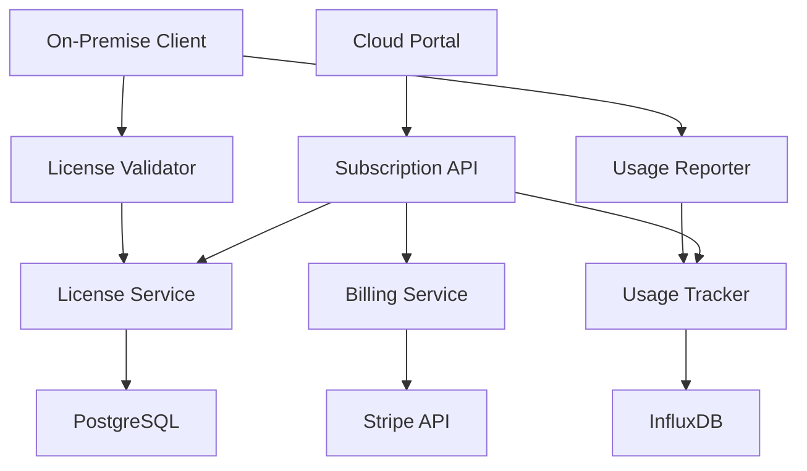

# 📜 Subscription and License Planning
updated: 01/20/25

## Project Overview
Developing a comprehensive subscription and license management system for an On-Premises LLM-as-a-Service platform targeting SMBs (50-200 employees). This system must handle multi-tenant subscriptions, usage enforcement, billing automation, and secure license validation across hybrid cloud/on-premises deployments.

## Current Implementation Status
**Implementation Phase**: Architectural Planning & Design

**Key Characteristics**:
- **Multi-Tenant Architecture**: Organization-based subscription isolation
- **Hybrid License Model**: Cloud-managed subscriptions with on-premises enforcement
- **Real-Time Usage Tracking**: Live monitoring and automatic limit enforcement
- **Automated Billing Integration**: Stripe-powered subscription lifecycle management
- **Security-First Design**: Encrypted license keys with tamper-proof validation

---

## 💡 Tiered Subscription System

### Proposed Tiers and Pricing

| Tier           | Users Included | Data Volume | Model Size    | Price (per year) | Add-ons                             |
|----------------|----------------|-------------|---------------|------------------|--------------------------------------|
| **Starter**     | 5 analysts      | ≤1 TB       | Small LLM/SLM | $30 k            | +$5 k per additional TB            |
| **Professional**| 10 analysts     | ≤3 TB       | Medium LLM    | $60 k            | +$4 k per additional TB            |
| **Enterprise**  | Unlimited       | ≤5 TB       | Medium+ LLM   | $120 k           | Custom add-ons  modules           |

**Add-ons**:
- Extra data ($/TB)
- Custom analytics modules
- Employee training sessions
- Dedicated support / enhanced SLA

### Detailed Feature Matrix

| Feature | Starter | Professional | Enterprise |
|---------|---------|--------------|------------|
| **Users** | 5 analysts | 10 analysts | Unlimited |
| **Data Volume** | 1 TB | 3 TB | 5 TB |
| **Model Size** | Small LLM | Medium LLM | Large LLM |
| **API Calls/Month** | 10,000 | 50,000 | Unlimited |
| **Custom Models** | ❌ | ✅ | ✅ |
| **Advanced Analytics** | ❌ | ✅ | ✅ |
| **White Labeling** | ❌ | ❌ | ✅ |
| **Support Level** | Email | Priority | Dedicated |
| **SLA** | Best Effort | 99.5% | 99.9% |
| **Training Sessions** | Self-service | 2 sessions | Unlimited |
| **Custom Integrations** | ❌ | Limited | Full |

### Subscription Lifecycle Management

#### Purchase Flow
1. **Plan Selection** → Customer selects tier via cloud portal
2. **Payment Processing** → Stripe handles payment and verification
3. **Account Provisioning** → Automated organization setup and user creation
4. **License Generation** → Secure license key creation and delivery
5. **Onboarding** → Guided setup with installation instructions

#### Usage Enforcement Points
```typescript
// Key enforcement checkpoints
interface SubscriptionLimits {
  maxUsers: number;
  maxDataVolumeGB: number;
  maxApiCalls: number;
  allowedFeatures: string[];
  modelSize: 'small' | 'medium' | 'large';
}

// Real-time validation
const validateUsage = (action: string, currentUsage: Usage) => {
  const limits = subscription.limits;
  
  switch (action) {
    case 'ADD_USER':
      return currentUsage.users < limits.maxUsers;
    case 'UPLOAD_DATA':
      return currentUsage.dataVolumeGB < limits.maxDataVolumeGB;
    case 'API_CALL':
      return currentUsage.apiCalls < limits.maxApiCalls;
    case 'ACCESS_FEATURE':
      return limits.allowedFeatures.includes(feature);
  }
};
```

---

## 🏗️ System Architecture Overview

### Cloud-Based Subscription Management

#### Core Components


#### Service Responsibilities
- **Subscription API**: CRUD operations for subscriptions, organizations, users
- **License Service**: Key generation, validation, expiration management
- **Usage Tracker**: Real-time usage collection and limit enforcement
- **Billing Service**: Payment processing, invoicing, subscription lifecycle
- **License Validator**: On-premises license verification and feature gating
- **Usage Reporter**: Client-side usage data collection and transmission

### On-Premises License Enforcement

#### Client-Side Components
```typescript
// License validation client
class LicenseManager {
  private licenseKey: string;
  private subscriptionData: SubscriptionData;
  private lastValidation: Date;
  
  async validateLicense(): Promise<boolean> {
    try {
      const response = await fetch(`${API_BASE}/license/validate`, {
        headers: { 'Authorization': `Bearer ${this.licenseKey}` }
      });
      
      const validation = await response.json();
      this.subscriptionData = validation.subscription;
      this.lastValidation = new Date();
      
      return validation.isValid && !validation.isExpired;
    } catch (error) {
      // Graceful degradation - allow continued use for 7 days
      const daysSinceValidation = (Date.now() - this.lastValidation.getTime()) / (1000 * 60 * 60 * 24);
      return daysSinceValidation < 7;
    }
  }
  
  checkFeatureAccess(feature: string): boolean {
    return this.subscriptionData.allowedFeatures.includes(feature);
  }
  
  checkUsageLimit(metric: string, currentValue: number): boolean {
    const limit = this.subscriptionData.limits[metric];
    return currentValue < limit;
  }
}
```

---

## 🔧 Technical Stack Proposal

### License Key Management

#### Recommended Stack
- **Backend**: Node.js + Express
- **Database**: PostgreSQL for license data
- **Authentication**: Auth0 or Clerk
- **Messaging**: Kafka or RabbitMQ for event-driven updates
- **API Gateway**: Kong or AWS API Gateway for routing

#### License Validation Workflow
1. **Key Generation**: On purchase, generate unique license keys linked to client ID
2. **Activation**: Client activates license via cloud portal
3. **Validation**: Daily validation checks using secure tokens
4. **Expiration**: Automatic notification and renewal prompts 30 days before expiry
5. **Revocation**: Immediate disablement if violation detected

### Usage Tracking and Monitoring

#### Recommended Stack
- **Data Processing**: Apache Kafka for tracking events
- **Storage**: InfluxDB for time-series usage data
- **Visualization**: Grafana for dashboards and alerts
- **Alerting**: Prometheus alert manager for threshold breaches

#### Usage Metrics to Track
- Number of active users
- Total data volume processed
- Queries executed per month
- Model training hours logged

### Subscription Management Dashboard

#### Recommended Stack
- **Frontend**: React + Tailwind CSS
- **State Management**: Redux or Zustand
- **Analytics**: Firebase Analytics for user interactions
- **Billing**: Stripe for secure payments and invoicing

#### Key Features
- Tier selection and upgrades/downgrades
- Live usage monitoring and alerts
- Automated billing and invoice generation
- Support ticket system integration
- User management and organization grouping

---

## 💾 Database Schema Design

### Core Tables

#### Organizations Table
```sql
CREATE TABLE organizations (
  id UUID PRIMARY KEY DEFAULT gen_random_uuid(),
  name VARCHAR(255) NOT NULL,
  domain VARCHAR(255),
  industry VARCHAR(100),
  employee_count INTEGER,
  created_at TIMESTAMP DEFAULT CURRENT_TIMESTAMP,
  updated_at TIMESTAMP DEFAULT CURRENT_TIMESTAMP
);
```

#### Subscriptions Table
```sql
CREATE TABLE subscriptions (
  id UUID PRIMARY KEY DEFAULT gen_random_uuid(),
  organization_id UUID REFERENCES organizations(id),
  tier VARCHAR(50) NOT NULL, -- 'starter', 'professional', 'enterprise'
  status VARCHAR(50) DEFAULT 'active', -- 'active', 'suspended', 'cancelled'
  start_date DATE NOT NULL,
  end_date DATE NOT NULL,
  auto_renew BOOLEAN DEFAULT true,
  
  -- Limits
  max_users INTEGER NOT NULL,
  max_data_volume_gb INTEGER NOT NULL,
  max_api_calls_monthly INTEGER,
  allowed_features JSONB,
  
  -- Pricing
  base_price_annual DECIMAL(10,2) NOT NULL,
  current_addons JSONB,
  
  created_at TIMESTAMP DEFAULT CURRENT_TIMESTAMP,
  updated_at TIMESTAMP DEFAULT CURRENT_TIMESTAMP
);
```

#### License Keys Table
```sql
CREATE TABLE license_keys (
  id UUID PRIMARY KEY DEFAULT gen_random_uuid(),
  subscription_id UUID REFERENCES subscriptions(id),
  key_hash VARCHAR(255) UNIQUE NOT NULL,
  key_encrypted TEXT NOT NULL,
  is_active BOOLEAN DEFAULT true,
  last_validated_at TIMESTAMP,
  validation_count INTEGER DEFAULT 0,
  created_at TIMESTAMP DEFAULT CURRENT_TIMESTAMP,
  expires_at TIMESTAMP NOT NULL
);
```

#### Usage Tracking Table
```sql
CREATE TABLE usage_metrics (
  id UUID PRIMARY KEY DEFAULT gen_random_uuid(),
  organization_id UUID REFERENCES organizations(id),
  subscription_id UUID REFERENCES subscriptions(id),
  metric_type VARCHAR(50) NOT NULL, -- 'users', 'data_volume', 'api_calls', 'training_hours'
  metric_value DECIMAL(15,2) NOT NULL,
  recorded_at TIMESTAMP DEFAULT CURRENT_TIMESTAMP,
  reporting_period DATE -- YYYY-MM-DD for monthly aggregation
);
```

#### Users Table
```sql
CREATE TABLE users (
  id UUID PRIMARY KEY DEFAULT gen_random_uuid(),
  organization_id UUID REFERENCES organizations(id),
  email VARCHAR(255) UNIQUE NOT NULL,
  role VARCHAR(50) DEFAULT 'analyst', -- 'admin', 'analyst', 'viewer'
  is_active BOOLEAN DEFAULT true,
  last_login_at TIMESTAMP,
  created_at TIMESTAMP DEFAULT CURRENT_TIMESTAMP
);
```

### Indexes and Performance Optimization
```sql
-- Performance indexes
CREATE INDEX idx_subscriptions_org_status ON subscriptions(organization_id, status);
CREATE INDEX idx_license_keys_subscription ON license_keys(subscription_id, is_active);
CREATE INDEX idx_usage_metrics_org_period ON usage_metrics(organization_id, reporting_period);
CREATE INDEX idx_users_org_active ON users(organization_id, is_active);
```

---

## 🔌 API Specifications

### License Validation API

#### POST /api/v1/license/validate
```typescript
// Request
interface LicenseValidationRequest {
  licenseKey: string;
  clientInfo: {
    version: string;
    deployment_id: string;
    last_sync: string;
  };
}

// Response
interface LicenseValidationResponse {
  isValid: boolean;
  isExpired: boolean;
  subscription: {
    tier: string;
    limits: SubscriptionLimits;
    features: string[];
    expiresAt: string;
  };
  organization: {
    id: string;
    name: string;
  };
  validationId: string;
}
```

#### POST /api/v1/usage/report
```typescript
// Request
interface UsageReportRequest {
  licenseKey: string;
  metrics: {
    activeUsers: number;
    dataVolumeGB: number;
    apiCallsCount: number;
    trainingHours: number;
  };
  reportingPeriod: string; // YYYY-MM-DD
}

// Response
interface UsageReportResponse {
  acknowledged: boolean;
  warningsIssued: string[];
  limitsApproaching: string[];
  nextReportDue: string;
}
```

### Subscription Management API

#### GET /api/v1/subscriptions/{orgId}
```typescript
// Response
interface SubscriptionDetails {
  id: string;
  tier: string;
  status: string;
  limits: SubscriptionLimits;
  currentUsage: UsageMetrics;
  billing: {
    nextBillingDate: string;
    amountDue: number;
    paymentMethod: string;
  };
  addons: AddonDetails[];
}
```

#### POST /api/v1/subscriptions/{orgId}/upgrade
```typescript
// Request
interface UpgradeRequest {
  targetTier: string;
  addons?: AddonRequest[];
  effectiveDate?: string;
}

// Response
interface UpgradeResponse {
  success: boolean;
  newSubscriptionId: string;
  proratedAmount: number;
  effectiveDate: string;
  newLicenseKey: string;
}
```

---

## 📊 Billing Integration Strategy

### Stripe Integration Architecture

#### Product Catalog Setup
```typescript
// Stripe product configuration
const subscriptionProducts = {
  starter: {
    priceId: 'price_starter_annual',
    baseFeatures: ['basic_analytics', 'email_support'],
    limits: { users: 5, dataGB: 1000, apiCalls: 10000 }
  },
  professional: {
    priceId: 'price_professional_annual',
    baseFeatures: ['advanced_analytics', 'priority_support', 'custom_models'],
    limits: { users: 10, dataGB: 3000, apiCalls: 50000 }
  },
  enterprise: {
    priceId: 'price_enterprise_annual',
    baseFeatures: ['all_features', 'dedicated_support', 'white_labeling'],
    limits: { users: -1, dataGB: 5000, apiCalls: -1 } // -1 = unlimited
  }
};
```

#### Automated Billing Workflow
```typescript
// Subscription lifecycle management
class SubscriptionManager {
  async handleStripeWebhook(event: Stripe.Event) {
    switch (event.type) {
      case 'invoice.payment_succeeded':
        await this.activateSubscription(event.data.object);
        break;
      case 'invoice.payment_failed':
        await this.suspendSubscription(event.data.object);
        break;
      case 'customer.subscription.updated':
        await this.updateSubscriptionLimits(event.data.object);
        break;
      case 'customer.subscription.deleted':
        await this.cancelSubscription(event.data.object);
        break;
    }
  }
  
  async createSubscription(orgId: string, tier: string) {
    // 1. Create Stripe customer
    const customer = await stripe.customers.create({...});
    
    // 2. Create Stripe subscription
    const subscription = await stripe.subscriptions.create({...});
    
    // 3. Store in database
    const dbSubscription = await db.subscriptions.create({...});
    
    // 4. Generate license key
    const licenseKey = await this.generateLicenseKey(dbSubscription.id);
    
    // 5. Send onboarding email
    await this.sendOnboardingEmail(orgId, licenseKey);
    
    return { subscriptionId: dbSubscription.id, licenseKey };
  }
}
```

### Usage-Based Billing Components

#### Add-on Pricing Calculation
```typescript
// Dynamic addon pricing
class AddonPricingEngine {
  calculateDataOverageCharge(tier: string, currentUsageGB: number, limitGB: number): number {
    if (currentUsageGB <= limitGB) return 0;
    
    const overageGB = currentUsageGB - limitGB;
    const ratePerGB = tier === 'starter' ? 5000 : 4000; // $5k or $4k per TB
    
    return Math.ceil(overageGB / 1000) * ratePerGB; // Round up to full TB
  }
  
  async generateMonthlyInvoice(orgId: string) {
    const subscription = await db.subscriptions.findByOrgId(orgId);
    const usage = await db.usage_metrics.getMonthlyTotals(orgId);
    
    let totalCharges = subscription.base_price_annual / 12;
    
    // Add overage charges
    const dataOverage = this.calculateDataOverageCharge(
      subscription.tier,
      usage.dataVolumeGB,
      subscription.max_data_volume_gb
    );
    
    totalCharges += dataOverage;
    
    return { baseCharge: subscription.base_price_annual / 12, overageCharges: dataOverage, total: totalCharges };
  }
}
```

---

## 🏛️ Security and Compliance Considerations

### Security Practices
- **Encrypted Storage**: License keys and sensitive data encrypted at rest
- **Secure Communication**: Use of TLS for all client-server communications
- **Regular Audits**: Periodic security audits and vulnerability assessments

### Compliance Requirements
- **Data Privacy Laws**: GDPR, CCPA adherence
- **Financial Compliance**: PCI DSS for payment processing
- **Access Control**: Strict RBAC for management interfaces

---

## 🔒 Advanced Security Specifications

### License Key Encryption Strategy

#### Key Generation Algorithm
```typescript
// Secure license key generation
import { randomBytes, createCipher, createHash } from 'crypto';

class LicenseKeyGenerator {
  private readonly SECRET_KEY = process.env.LICENSE_ENCRYPTION_KEY;
  
  generateLicenseKey(subscriptionId: string, orgId: string): string {
    const payload = {
      subscriptionId,
      orgId,
      issuedAt: Date.now(),
      entropy: randomBytes(16).toString('hex')
    };
    
    const payloadString = JSON.stringify(payload);
    const cipher = createCipher('aes-256-cbc', this.SECRET_KEY);
    
    let encrypted = cipher.update(payloadString, 'utf8', 'hex');
    encrypted += cipher.final('hex');
    
    // Add checksum for tamper detection
    const checksum = createHash('sha256').update(encrypted + this.SECRET_KEY).digest('hex').substring(0, 8);
    
    return `${encrypted}-${checksum}`;
  }
  
  validateLicenseKey(licenseKey: string): { isValid: boolean; payload?: any } {
    try {
      const [encrypted, providedChecksum] = licenseKey.split('-');
      
      // Verify checksum
      const expectedChecksum = createHash('sha256').update(encrypted + this.SECRET_KEY).digest('hex').substring(0, 8);
      if (providedChecksum !== expectedChecksum) {
        return { isValid: false };
      }
      
      // Decrypt payload
      const decipher = createDecipher('aes-256-cbc', this.SECRET_KEY);
      let decrypted = decipher.update(encrypted, 'hex', 'utf8');
      decrypted += decipher.final('utf8');
      
      const payload = JSON.parse(decrypted);
      return { isValid: true, payload };
    } catch (error) {
      return { isValid: false };
    }
  }
}
```

#### Rate Limiting and Abuse Prevention
```typescript
// License validation rate limiting
class ValidationRateLimiter {
  private attempts: Map<string, { count: number; resetTime: number }> = new Map();
  
  async checkRateLimit(licenseKey: string): Promise<boolean> {
    const keyHash = createHash('sha256').update(licenseKey).digest('hex');
    const now = Date.now();
    const windowSize = 24 * 60 * 60 * 1000; // 24 hours
    const maxAttempts = 1440; // Every minute for 24 hours
    
    const record = this.attempts.get(keyHash);
    
    if (!record || now > record.resetTime) {
      this.attempts.set(keyHash, { count: 1, resetTime: now + windowSize });
      return true;
    }
    
    if (record.count >= maxAttempts) {
      return false; // Rate limit exceeded
    }
    
    record.count++;
    return true;
  }
}
```

### Compliance and Audit Framework

#### Data Retention Policy
```typescript
// Automated data cleanup for compliance
class DataRetentionManager {
  async enforceRetentionPolicies() {
    // Delete usage metrics older than 3 years (tax/audit requirements)
    await db.query(`
      DELETE FROM usage_metrics 
      WHERE recorded_at < NOW() - INTERVAL '3 years'
    `);
    
    // Archive inactive license keys after 1 year
    await db.query(`
      UPDATE license_keys 
      SET is_active = false 
      WHERE expires_at < NOW() - INTERVAL '1 year' 
      AND is_active = true
    `);
    
    // Anonymize cancelled subscription data after 7 years
    await db.query(`
      UPDATE subscriptions 
      SET 
        organization_id = NULL,
        current_addons = '{}'
      WHERE status = 'cancelled' 
      AND updated_at < NOW() - INTERVAL '7 years'
    `);
  }
}
```

#### Audit Logging System
```typescript
// Comprehensive audit logging
interface AuditEvent {
  eventType: string;
  userId?: string;
  organizationId?: string;
  subscriptionId?: string;
  details: Record<string, any>;
  ipAddress: string;
  userAgent: string;
  timestamp: Date;
}

class AuditLogger {
  async logEvent(event: AuditEvent) {
    await db.audit_logs.create({
      ...event,
      event_hash: this.generateEventHash(event)
    });
    
    // Also log to external audit service for immutability
    await this.sendToExternalAuditService(event);
  }
  
  private generateEventHash(event: AuditEvent): string {
    const eventString = JSON.stringify(event);
    return createHash('sha256').update(eventString).digest('hex');
  }
}
```

---

## 🚀 Deployment and Infrastructure Strategy

### Cloud Infrastructure Architecture

#### AWS-Based Deployment
```yaml
# Infrastructure as Code (Terraform)
resource "aws_ecs_cluster" "subscription_management" {
  name = "subscription-management-cluster"
}

resource "aws_rds_cluster" "main_db" {
  engine             = "aurora-postgresql"
  engine_version     = "13.7"
  database_name      = "subscription_db"
  master_username    = "admin"
  backup_retention_period = 35
  preferred_backup_window = "07:00-09:00"
  
  # Multi-AZ for high availability
  availability_zones = ["us-west-2a", "us-west-2b", "us-west-2c"]
}

resource "aws_elasticache_cluster" "redis" {
  cluster_id           = "subscription-cache"
  engine               = "redis"
  node_type            = "cache.t3.micro"
  num_cache_nodes      = 1
  parameter_group_name = "default.redis7"
}
```

#### Container Orchestration
```dockerfile
# Subscription API Dockerfile
FROM node:18-alpine

WORKDIR /app

# Install dependencies
COPY package*.json ./
RUN npm ci --only=production

# Copy application code
COPY src/ ./src/
COPY config/ ./config/

# Create non-root user for security
RUN addgroup -g 1001 -S nodejs
RUN adduser -S subscription -u 1001

USER subscription

EXPOSE 3000

HEALTHCHECK --interval=30s --timeout=3s --start-period=5s --retries=3 \
  CMD curl -f http://localhost:3000/health || exit 1

CMD ["node", "src/index.js"]
```

#### Monitoring and Observability
```typescript
// Application monitoring setup
import { createPrometheusMetrics } from '@prometheus/client';

class MetricsCollector {
  private subscriptionGauge = new Gauge({
    name: 'active_subscriptions_total',
    help: 'Total number of active subscriptions',
    labelNames: ['tier']
  });
  
  private licenseValidationCounter = new Counter({
    name: 'license_validations_total',
    help: 'Total number of license validation requests',
    labelNames: ['status', 'tier']
  });
  
  private usageReportHistogram = new Histogram({
    name: 'usage_report_processing_seconds',
    help: 'Time spent processing usage reports',
    buckets: [0.1, 0.5, 1, 2, 5]
  });
  
  updateSubscriptionMetrics(tier: string, count: number) {
    this.subscriptionGauge.set({ tier }, count);
  }
  
  recordLicenseValidation(status: string, tier: string) {
    this.licenseValidationCounter.inc({ status, tier });
  }
  
  recordUsageReportProcessing(duration: number) {
    this.usageReportHistogram.observe(duration);
  }
}
```

---

## 📅 Comprehensive Implementation Roadmap

### Phase 1: Foundation (Weeks 1-4)

#### Week 1-2: Infrastructure Setup
- [ ] Set up AWS/GCP cloud infrastructure
- [ ] Configure PostgreSQL database with initial schema
- [ ] Set up Redis for caching and sessions
- [ ] Implement basic CI/CD pipeline
- [ ] Configure monitoring and logging (Prometheus, Grafana)

#### Week 3-4: Core Services Development
- [ ] Implement License Service with key generation/validation
- [ ] Build Subscription API with CRUD operations
- [ ] Set up Stripe integration for payment processing
- [ ] Implement basic usage tracking system
- [ ] Create audit logging framework

### Phase 2: Management Portal (Weeks 5-8)

#### Week 5-6: Frontend Development
- [ ] Build React-based subscription management dashboard
- [ ] Implement user authentication with Auth0/Clerk
- [ ] Create subscription tier selection and upgrade flows
- [ ] Build usage monitoring and analytics interface

#### Week 7-8: Integration and Testing
- [ ] Integrate frontend with subscription APIs
- [ ] Implement billing workflows and invoice generation
- [ ] Build customer support ticket system
- [ ] Comprehensive testing (unit, integration, e2e)

### Phase 3: Client-Side Integration (Weeks 9-12)

#### Week 9-10: License Client Development
- [ ] Build client-side license validation library
- [ ] Implement feature gating and usage enforcement
- [ ] Create usage reporting and metrics collection
- [ ] Build offline validation and graceful degradation

#### Week 11-12: Deployment and Documentation
- [ ] Package client library for distribution
- [ ] Create comprehensive integration documentation
- [ ] Build sample applications and tutorials
- [ ] Performance testing and optimization

### Phase 4: Advanced Features (Weeks 13-16)

#### Week 13-14: Enhanced Functionality
- [ ] Implement advanced analytics and reporting
- [ ] Build automated renewal and dunning management
- [ ] Create white-label customization options
- [ ] Implement enterprise SSO integration

#### Week 15-16: Security and Compliance
- [ ] Security audit and penetration testing
- [ ] GDPR/CCPA compliance implementation
- [ ] SOC 2 Type II audit preparation
- [ ] Final performance optimization and load testing

### Milestone Deliverables

| Milestone | Deliverable | Success Criteria |
|-----------|-------------|------------------|
| **M1** | Core Infrastructure | Database schema deployed, APIs responding |
| **M2** | License System | Key generation/validation working |
| **M3** | Billing Integration | Stripe webhooks processing payments |
| **M4** | Management Portal | Complete subscription management UI |
| **M5** | Client Integration | License enforcement in sample app |
| **M6** | Production Ready | Security audit passed, monitoring active |

---

## 📊 Success Metrics and KPIs

### Technical Performance Metrics
- **License Validation Response Time**: < 200ms (95th percentile)
- **System Uptime**: 99.9% availability (Enterprise SLA)
- **Database Query Performance**: < 50ms average response time
- **API Throughput**: 1000+ requests/second capacity

### Business Performance Metrics
- **Subscription Conversion Rate**: Target 15% trial-to-paid conversion
- **Customer Lifetime Value**: Target $180k+ (3-year average)
- **Churn Rate**: < 5% annually for paid subscriptions
- **Support Ticket Resolution**: < 24 hours average response time

### Operational Metrics
- **Deployment Frequency**: Daily deployments capability
- **Mean Time to Recovery**: < 1 hour for critical issues
- **Security Incident Response**: < 2 hours detection to containment
- **Compliance Audit Success**: 100% passing rate

---

## 📝 Documentation and Training Requirements

### Technical Documentation
1. **API Documentation**: OpenAPI/Swagger specs for all endpoints
2. **Integration Guides**: Step-by-step client integration tutorials
3. **Architecture Documentation**: System design and data flow diagrams
4. **Security Documentation**: Encryption, compliance, and audit procedures
5. **Operational Runbooks**: Deployment, monitoring, and troubleshooting guides

### Training Materials
1. **Customer Onboarding**: Video tutorials and interactive guides
2. **Developer Training**: SDK usage and integration best practices
3. **Support Team Training**: Subscription management and troubleshooting
4. **Sales Team Training**: Technical capabilities and competitive positioning

---

## 🔍 Risk Assessment and Mitigation

### Technical Risks
| Risk | Likelihood | Impact | Mitigation Strategy |
|------|------------|--------|-----------------|
| **License Key Compromise** | Medium | High | Multi-layer encryption, key rotation, audit logging |
| **Database Failure** | Low | High | Multi-AZ deployment, automated backups, failover testing |
| **Stripe Integration Issues** | Medium | High | Webhook retry logic, manual reconciliation processes |
| **Performance Bottlenecks** | High | Medium | Load testing, auto-scaling, caching strategies |

### Business Risks
| Risk | Likelihood | Impact | Mitigation Strategy |
|------|------------|--------|-----------------|
| **Pricing Model Rejection** | Medium | High | Flexible pricing options, pilot program feedback |
| **Compliance Violations** | Low | High | Regular audits, automated compliance checks |
| **Customer Data Breach** | Low | High | Security-first design, regular penetration testing |
| **Competitive Pressure** | High | Medium | Unique value proposition, customer lock-in features |

---

## 🏁 Next Steps and Action Items

### Immediate Priorities (Next 2 Weeks)
1. **Technical Stack Validation**
   - [ ] Architect review of proposed technology choices
   - [ ] Performance benchmarking of key components
   - [ ] Security review of encryption and key management
   - [ ] Cost analysis of cloud infrastructure requirements

2. **Market Validation**
   - [ ] Customer interviews to validate pricing model
   - [ ] Competitive analysis of similar subscription systems
   - [ ] Legal review of terms of service and privacy policy
   - [ ] Compliance requirements assessment (GDPR, SOC 2)

3. **Project Planning**
   - [ ] Detailed project timeline with resource allocation
   - [ ] Team formation and role assignments
   - [ ] Development environment setup and tooling
   - [ ] Risk assessment and contingency planning

### Medium-Term Goals (Next 3 Months)
1. **MVP Development**: Complete core subscription management system
2. **Pilot Program**: Launch with 3-5 beta customers
3. **Feedback Integration**: Refine system based on pilot feedback
4. **Security Audit**: Complete initial security assessment
5. **Documentation**: Comprehensive technical and user documentation

### Long-Term Vision (6-12 Months)
1. **Market Launch**: Full commercial availability
2. **Scale Operations**: Support 100+ concurrent subscriptions
3. **Advanced Features**: AI-powered usage optimization, predictive billing
4. **Global Expansion**: Multi-region deployment, international compliance
5. **Partner Ecosystem**: Integration marketplace and reseller program

---

This comprehensive subscription and license planning document provides the technical foundation, business framework, and implementation roadmap necessary to build a scalable, secure, and profitable subscription management system for the On-Premises LLM-as-a-Service platform.

