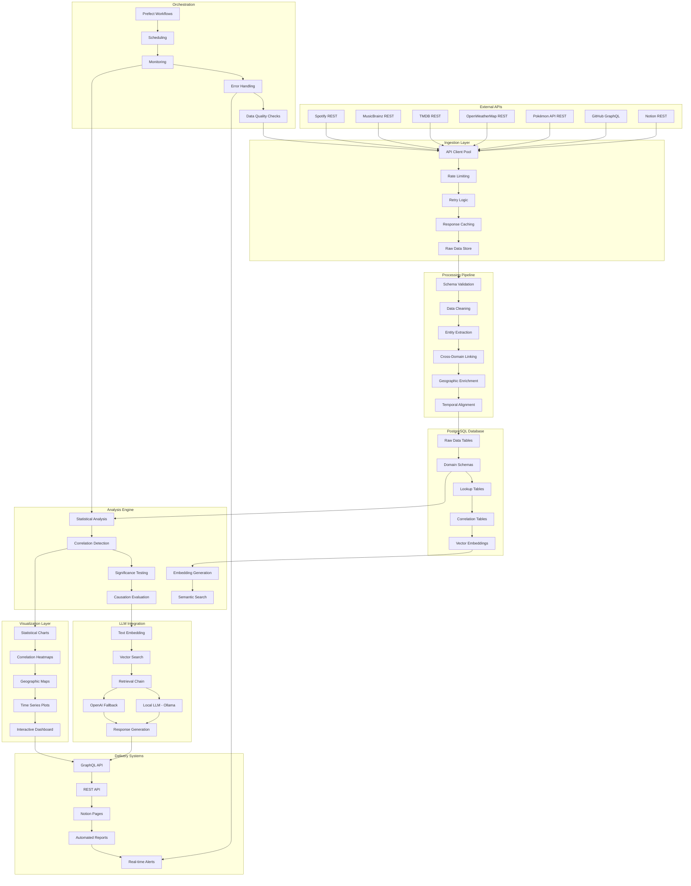

# Implementation Plan – Data Centralization Platform

Transform scattered public APIs into unified, LLM-ready knowledge while surfacing actionable insights through sophisticated correlation analysis and interactive visualizations.

---

## 1. Strategic Goals

1. **Multi-Domain Data Aggregation**: Collect and centralize data from 6 diverse APIs (music, entertainment, weather, gaming, development, productivity) into a unified PostgreSQL database.

2. **Cross-Domain Correlation Discovery**: Implement sophisticated statistical analysis to surface fascinating relationships between seemingly unrelated domains while maintaining scientific rigor about correlation vs. causation.

3. **LLM-Powered Insights**: Deploy local and cloud-based LLM integration for natural language querying of correlations, with embedding-based semantic search over enriched datasets.

4. **Interactive Visualization**: Create dynamic charts, heatmaps, and geographic visualizations that allow users to explore data relationships through multiple dimensions.

5. **Notion Intelligence Export**: Automatically generate insight reports, correlation alerts, and data summaries as organized Notion pages with embedded visualizations.

6. **Enterprise-Grade Demonstration**: Showcase production-ready patterns including microservices architecture, containerization, CI/CD, comprehensive testing, and statistical validation.

## 2. Comprehensive Architecture Stack

| Layer | Purpose | Technology Choices | Demonstrates |
|-------|---------|-------------------|-------------|
| **API Client Layer** | Typed wrappers with rate limiting, retry logic, and caching | Python 3.11 + httpx + pydantic + tenacity | REST & GraphQL integration patterns |
| **Ingestion Services** | Containerized async workers with queue-based processing | FastAPI + Celery/Dramatiq + Redis | Microservices, async programming |
| **Data Processing** | ETL pipeline with cross-domain entity linking | pandas/polars + pydantic + SQLModel | Data engineering, schema design |
| **Knowledge Layer** | Multi-schema database with vector search capabilities | PostgreSQL 16 + pgvector + Alembic | Database design, vector search |
| **Statistical Analysis** | Correlation analysis with significance testing | SciPy + NumPy + statsmodels | Data science, statistical rigor |
| **Orchestration** | DAG-based workflows with monitoring | Prefect 2 + monitoring dashboard | Workflow orchestration, observability |
| **Visualization** | Interactive charts and real-time dashboards | Plotly + Dash + D3.js + Mapbox | Data visualization, frontend skills |
| **LLM Integration** | Embedding generation and retrieval-augmented generation | LangChain + pgvector + Ollama/OpenAI | AI/ML integration, prompt engineering |
| **API Gateway** | Unified data access with GraphQL and REST endpoints | FastAPI + Strawberry-GraphQL + auth | API design, GraphQL schema |
| **Notion Integration** | Automated report generation and insight publishing | Notion SDK + rich formatting | Business intelligence, automation |
| **DevOps** | Full CI/CD pipeline with testing and deployment | Docker Compose + GitHub Actions + pytest | DevOps practices, testing strategies |

## 3. External APIs & Rich Entity Mapping

| API | Protocol | Key Entities | Unique Data Points | Cross-Domain Links |
|-----|----------|-------------|-------------------|-------------------|
| **Spotify** | REST | Track, Album, Artist, Audio Features | `valence`, `danceability`, `energy`, `acousticness` | `isrc` → MusicBrainz, `release_date` → Weather |
| **MusicBrainz** | REST | Release, Recording, Artist, Label | `mbid`, `country`, `label-info`, `recording-location` | `mbid` → Spotify, `area` → Weather coordinates |
| **TMDB** | REST | Movie, TV Show, Person, Genre | `budget`, `revenue`, `production_countries`, `vote_average` | `release_date` → Weather, `production_countries` → GitHub activity |
| **OpenWeatherMap** | REST | Weather Observation, Historical Data | `temperature`, `humidity`, `conditions`, `pressure` | `lat/lon` → All location-based entities |
| **Pokémon API** | REST | Pokémon, Species, Ability, Type | `habitat`, `generation`, `stats`, `evolution_chain` | `types` → Weather conditions, `habitat` → Geographic regions |
| **GitHub** | GraphQL | Repository, Commit, User, Release | `topics`, `language`, `stargazerCount`, `contributionsCollection` | `createdAt` → Release dates, `topics` → Entertainment genres |
| **Notion** | REST | Page, Database, Block, Property | `created_time`, `properties`, `content` | Central hub for insights and correlations |

## 4. Enhanced Database Design (PostgreSQL + pgvector)

### 4.1 Raw Data & Lookup Tables
```sql
-- Raw API responses with full audit trail
CREATE TABLE raw_data (
    id SERIAL PRIMARY KEY,
    api_source TEXT NOT NULL,
    endpoint TEXT NOT NULL,
    request_params JSONB,
    response_data JSONB NOT NULL,
    retrieved_at TIMESTAMPTZ DEFAULT NOW(),
    processing_status TEXT DEFAULT 'pending'
);

-- Geographic lookup for coordinate-based linking
CREATE TABLE locations (
    id SERIAL PRIMARY KEY,
    name TEXT NOT NULL,
    country_code CHAR(2),
    latitude DECIMAL(10,8),
    longitude DECIMAL(11,8),
    timezone TEXT,
    created_at TIMESTAMPTZ DEFAULT NOW()
);

-- Time-based lookup for temporal correlations
CREATE TABLE time_periods (
    id SERIAL PRIMARY KEY,
    period_start DATE NOT NULL,
    period_end DATE NOT NULL,
    season TEXT,
    year INTEGER,
    quarter INTEGER,
    month INTEGER
);
```

### 4.2 Domain-Specific Schemas
```sql
-- Music domain with rich metadata
CREATE SCHEMA music;
CREATE TABLE music.artists (
    id SERIAL PRIMARY KEY,
    name TEXT NOT NULL,
    mbid UUID,
    spotify_id TEXT,
    country TEXT,
    genres TEXT[],
    popularity INTEGER,
    followers INTEGER,
    location_id INTEGER REFERENCES locations(id)
);

CREATE TABLE music.releases (
    id SERIAL PRIMARY KEY,
    title TEXT NOT NULL,
    artist_id INTEGER REFERENCES music.artists(id),
    mbid UUID,
    spotify_id TEXT,
    release_date DATE,
    release_precision TEXT,
    label TEXT,
    country TEXT,
    location_id INTEGER REFERENCES locations(id),
    weather_id INTEGER REFERENCES weather.observations(id)
);

CREATE TABLE music.tracks (
    id SERIAL PRIMARY KEY,
    title TEXT NOT NULL,
    release_id INTEGER REFERENCES music.releases(id),
    spotify_id TEXT,
    isrc TEXT,
    duration_ms INTEGER,
    popularity INTEGER,
    valence DECIMAL(3,2),
    danceability DECIMAL(3,2),
    energy DECIMAL(3,2),
    acousticness DECIMAL(3,2),
    instrumentalness DECIMAL(3,2),
    tempo DECIMAL(6,2)
);

-- Weather domain with historical tracking
CREATE SCHEMA weather;
CREATE TABLE weather.observations (
    id SERIAL PRIMARY KEY,
    location_id INTEGER REFERENCES locations(id),
    observed_at TIMESTAMPTZ NOT NULL,
    temperature_c DECIMAL(5,2),
    humidity INTEGER,
    pressure_hpa DECIMAL(7,2),
    conditions TEXT,
    description TEXT,
    cloud_cover INTEGER,
    wind_speed_ms DECIMAL(5,2),
    weather_code INTEGER
);

-- Entertainment domain with cultural context
CREATE SCHEMA entertainment;
CREATE TABLE entertainment.movies (
    id SERIAL PRIMARY KEY,
    title TEXT NOT NULL,
    tmdb_id INTEGER UNIQUE,
    imdb_id TEXT,
    overview TEXT,
    release_date DATE,
    runtime INTEGER,
    budget BIGINT,
    revenue BIGINT,
    vote_average DECIMAL(3,1),
    genres TEXT[],
    production_countries TEXT[],
    location_id INTEGER REFERENCES locations(id),
    weather_id INTEGER REFERENCES weather.observations(id)
);

-- Gaming/Pop Culture domain
CREATE SCHEMA pokemon;
CREATE TABLE pokemon.species (
    id SERIAL PRIMARY KEY,
    pokemon_id INTEGER UNIQUE,
    name TEXT NOT NULL,
    height INTEGER,
    weight INTEGER,
    types TEXT[],
    abilities TEXT[],
    habitat TEXT,
    generation INTEGER,
    color TEXT,
    location_id INTEGER REFERENCES locations(id)
);

-- Development domain with activity tracking
CREATE SCHEMA github;
CREATE TABLE github.repositories (
    id SERIAL PRIMARY KEY,
    github_id BIGINT UNIQUE,
    name TEXT NOT NULL,
    owner TEXT NOT NULL,
    description TEXT,
    language TEXT,
    topics TEXT[],
    stars INTEGER,
    forks INTEGER,
    created_at TIMESTAMPTZ,
    updated_at TIMESTAMPTZ,
    location_id INTEGER REFERENCES locations(id)
);

CREATE TABLE github.commit_activity (
    id SERIAL PRIMARY KEY,
    repository_id INTEGER REFERENCES github.repositories(id),
    commit_date DATE NOT NULL,
    commit_count INTEGER,
    additions INTEGER,
    deletions INTEGER,
    weather_id INTEGER REFERENCES weather.observations(id)
);

-- Productivity domain (Notion integration)
CREATE SCHEMA productivity;
CREATE TABLE productivity.insights (
    id SERIAL PRIMARY KEY,
    notion_page_id TEXT UNIQUE,
    title TEXT NOT NULL,
    insight_type TEXT,
    correlation_strength DECIMAL(3,2),
    data_sources TEXT[],
    generated_at TIMESTAMPTZ DEFAULT NOW(),
    content JSONB
);
```

### 4.3 Advanced Vector Search & Correlations
```sql
-- Vector embeddings for semantic search
CREATE SCHEMA llm;
CREATE TABLE llm.embeddings (
    id SERIAL PRIMARY KEY,
    entity_type TEXT NOT NULL,
    entity_id INTEGER NOT NULL,
    embedding_model TEXT NOT NULL,
    vector vector(384), -- Using 384-dim embeddings
    created_at TIMESTAMPTZ DEFAULT NOW(),
    UNIQUE(entity_type, entity_id, embedding_model)
);

-- Correlation analysis results
CREATE TABLE llm.correlations (
    id SERIAL PRIMARY KEY,
    source_entity_type TEXT NOT NULL,
    source_entity_id INTEGER NOT NULL,
    target_entity_type TEXT NOT NULL,
    target_entity_id INTEGER NOT NULL,
    correlation_coefficient DECIMAL(5,4),
    p_value DECIMAL(10,8),
    sample_size INTEGER,
    analysis_date TIMESTAMPTZ DEFAULT NOW(),
    methodology TEXT,
    significance_level DECIMAL(3,2)
);

-- Indexes for performance
CREATE INDEX idx_embeddings_vector ON llm.embeddings USING ivfflat (vector vector_cosine_ops);
CREATE INDEX idx_correlations_strength ON llm.correlations (correlation_coefficient DESC);
CREATE INDEX idx_weather_location_time ON weather.observations (location_id, observed_at);
CREATE INDEX idx_releases_date ON music.releases (release_date);
CREATE INDEX idx_movies_date ON entertainment.movies (release_date);
```

## 5. Comprehensive Data Flow Architecture



## 6. Enhanced Service & Package Architecture

```
packages/
  shared_core/
    api/clients/
      spotify/          # REST client with auth + rate limiting
      musicbrainz/      # REST client with retry logic
      tmdb/             # REST client with caching
      openweathermap/   # REST client with historical data
      pokemon/          # REST client with batch processing
      github/           # GraphQL client with query optimization
      notion/           # REST client with rich formatting
    models/
      music.py          # Pydantic models for music domain
      entertainment.py  # Pydantic models for movies/TV
      weather.py        # Pydantic models for weather data
      pokemon.py        # Pydantic models for gaming data
      github.py         # Pydantic models for development data
      correlation.py    # Models for statistical analysis
    utils/
      statistical.py    # Correlation analysis, significance testing
      embedding.py      # Vector embedding generation
      geographic.py     # Location-based utilities
      temporal.py       # Time-based correlation helpers
    database/
      models.py         # SQLModel database models
      migrations/       # Alembic migration files
      connection.py     # Database connection management

services/
  data_collection/
    spotify_collector/      # Music streaming data ingestion
    musicbrainz_collector/  # Music metadata collection
    tmdb_collector/         # Entertainment data collection
    weather_collector/      # Weather data historical + current
    pokemon_collector/      # Gaming/pop culture data
    github_collector/       # Development activity tracking
  
  data_processing/
    entity_linker/          # Cross-domain relationship detection
    correlation_analyzer/   # Statistical correlation analysis
    geographic_enricher/    # Location-based data enhancement
    temporal_aligner/       # Time-based data synchronization
    embedding_generator/    # Vector embedding creation
    causation_evaluator/    # Correlation vs causation analysis
  
  insights/
    correlation_engine/     # Real-time correlation discovery
    significance_tester/    # Statistical validation
    pattern_detector/       # Anomaly and trend detection
    report_generator/       # Automated insight reporting
  
  delivery/
    api_gateway/            # GraphQL + REST unified API
    notion_exporter/        # Notion page generation
    visualization_service/  # Chart and graph generation
    alert_system/          # Real-time correlation alerts
  
  llm_integration/
    embedding_service/      # Text embedding generation
    vector_search/          # Semantic search over embeddings
    retrieval_chain/        # RAG implementation
    chat_service/           # LLM conversation interface
    evaluation/             # LLM response quality testing

flows/
  data_ingestion_flow/      # Prefect workflow for data collection
  processing_flow/          # ETL and analysis pipeline
  correlation_flow/         # Daily correlation analysis
  insight_generation_flow/  # Automated reporting
  notion_sync_flow/         # Notion page updates
```

## 7. Advanced LLM Integration Strategy

### 7.1 Multi-Model Embedding Strategy
```python
# Local embeddings for cost efficiency
nomic_embed = NomicEmbedding(model="nomic-embed-text-v1.5")

# OpenAI embeddings for comparison
openai_embed = OpenAIEmbedding(model="text-embedding-3-small")

# Specialized embeddings for different domains
music_embed = FinetuneEmbedding(base_model="nomic", domain="music")
```

### 7.2 Retrieval-Augmented Generation Pipeline
```python
# Vector store with pgvector
vector_store = PGVector(
    connection_string="postgresql://...",
    table_name="llm.embeddings",
    embedding_function=nomic_embed
)

# Retrieval chain with correlation context
retrieval_chain = ConversationalRetrievalChain(
    retriever=vector_store.as_retriever(),
    llm=local_llm,
    context_enricher=correlation_context_enricher
)
```

### 7.3 Local LLM Deployment
```yaml
# Ollama models for local deployment
models:
  - llama3:8b-instruct-q4_K_M  # 4-bit quantized for efficiency
  - phi3:3.8b-mini-instruct    # Lightweight for correlation analysis
  - codellama:7b-instruct      # Specialized for GitHub data
```

## 8. Intelligent Notion Delivery System

### 8.1 Automated Insight Page Generation
```python
@dataclass
class InsightPage:
    title: str
    correlation_strength: float
    significance_level: float
    data_sources: List[str]
    visualizations: List[str]
    causation_warnings: List[str]
    methodology: str
    
    def to_notion_blocks(self) -> List[Block]:
        # Generate rich Notion content with embedded charts
        pass
```

### 8.2 Real-time Correlation Alerts
```python
# Notion database for correlation tracking
CORRELATION_DB = {
    "properties": {
        "Correlation Strength": {"type": "number"},
        "Significance": {"type": "select"},
        "Data Sources": {"type": "multi_select"},
        "Alert Level": {"type": "select"},
        "Chart URL": {"type": "url"}
    }
}
```

## 9. Orchestration & Monitoring Framework

### 9.1 Prefect Workflow Architecture
```python
@flow(name="daily-correlation-analysis")
def daily_analysis_flow():
    # Data collection
    raw_data = collect_all_apis.map(["spotify", "github", "weather"])
    
    # Processing
    processed_data = process_data(raw_data)
    
    # Correlation analysis
    correlations = analyze_correlations(processed_data)
    
    # Significance testing
    significant_correlations = test_significance(correlations)
    
    # Visualization generation
    charts = generate_visualizations(significant_correlations)
    
    # Notion updates
    notion_updates = update_notion_pages(significant_correlations, charts)
    
    # LLM embedding updates
    embeddings = generate_embeddings(processed_data)
    
    return {
        "correlations_found": len(significant_correlations),
        "charts_generated": len(charts),
        "notion_pages_updated": len(notion_updates)
    }
```

### 9.2 Monitoring & Alerting
```python
# Data quality monitoring
@task
def data_quality_check(data: pd.DataFrame) -> Dict[str, float]:
    return {
        "completeness": data.notna().sum() / len(data),
        "correlation_strength": calculate_max_correlation(data),
        "sample_size": len(data),
        "temporal_coverage": calculate_date_range_coverage(data)
    }
```

## 10. Development & Deployment Strategy

### 10.1 Local Development Environment
```yaml
# docker-compose.yml
version: '3.8'
services:
  postgres:
    image: pgvector/pgvector:pg16
    environment:
      POSTGRES_DB: data_centralization
      POSTGRES_USER: dev_user
      POSTGRES_PASSWORD: dev_password
    volumes:
      - postgres_data:/var/lib/postgresql/data
      - ./sql/init.sql:/docker-entrypoint-initdb.d/init.sql
  
  redis:
    image: redis:7-alpine
    ports:
      - "6379:6379"
  
  ollama:
    image: ollama/ollama:latest
    volumes:
      - ollama_models:/root/.ollama
    ports:
      - "11434:11434"
  
  api_gateway:
    build: ./services/api_gateway
    ports:
      - "8000:8000"
    depends_on:
      - postgres
      - redis
  
  dashboard:
    build: ./services/dashboard
    ports:
      - "3000:3000"
    depends_on:
      - api_gateway
```

### 10.2 Production Deployment Options
```yaml
# Azure Container Apps deployment
apiVersion: containerapps.io/v1beta2
kind: ContainerApp
metadata:
  name: data-centralization-platform
spec:
  configuration:
    secrets:
      - name: postgres-connection
        value: "postgresql://..."
      - name: openai-api-key
        value: "sk-..."
  template:
    containers:
      - name: api-gateway
        image: ghcr.io/username/data-platform:latest
        env:
          - name: DATABASE_URL
            secretRef: postgres-connection
```

## 11. Detailed Milestones & Deliverables (15-20 hrs/week)

### **Phase 0: Foundation & Setup** (1 week)
**Hours**: 15-20 hours
**Deliverables**:
- PostgreSQL + pgvector Docker setup with all schemas
- Environment configuration (.env templates)
- Basic project structure with shared_core package
- Alembic migration framework
- Initial CI/CD pipeline setup

### **Phase 1: API Client Development** (2 weeks)
**Hours**: 30-40 hours
**Deliverables**:
- Spotify REST client with OAuth + rate limiting
- MusicBrainz REST client with retry logic
- TMDB REST client with caching
- OpenWeatherMap REST client (current + historical)
- Pokémon API REST client
- GitHub GraphQL client with query optimization
- Notion REST client with rich formatting
- Comprehensive test suite for all clients

### **Phase 2: Data Ingestion Services** (2 weeks)
**Hours**: 30-40 hours
**Deliverables**:
- Containerized collector services for each API
- Celery/Dramatiq task queue implementation
- Raw data storage with audit trail
- Error handling and retry mechanisms
- Data quality validation
- Monitoring and logging integration

### **Phase 3: Data Processing & ETL** (2.5 weeks)
**Hours**: 40-50 hours
**Deliverables**:
- Cross-domain entity linking algorithms
- Geographic enrichment service
- Temporal alignment service
- Data normalization and cleaning
- Database schema implementation
- Migration scripts for all domains

### **Phase 4: Statistical Analysis Engine** (2 weeks)
**Hours**: 30-40 hours
**Deliverables**:
- Correlation analysis with significance testing
- Causation evaluation framework
- Statistical validation (p-values, confidence intervals)
- Bias detection algorithms
- Correlation storage and indexing
- Real-time correlation detection

### **Phase 5: Visualization & Dashboard** (2 weeks)
**Hours**: 30-40 hours
**Deliverables**:
- Interactive correlation heatmaps
- Time series visualization
- Geographic correlation maps
- Statistical charts with confidence intervals
- Real-time dashboard with filters
- Chart export functionality

### **Phase 6: LLM Integration** (2 weeks)
**Hours**: 30-40 hours
**Deliverables**:
- Vector embedding generation (local + OpenAI)
- pgvector integration with semantic search
- Retrieval-augmented generation pipeline
- Local LLM deployment (Ollama)
- OpenAI fallback implementation
- Chat interface for correlation queries

### **Phase 7: Notion Intelligence Export** (1 week)
**Hours**: 15-20 hours
**Deliverables**:
- Automated insight page generation
- Rich Notion formatting with embedded charts
- Real-time correlation alerts
- Scheduled report generation
- Notion database integration

### **Phase 8: Orchestration & Monitoring** (1.5 weeks)
**Hours**: 20-30 hours
**Deliverables**:
- Prefect workflow implementation
- Automated scheduling (daily/weekly analyses)
- Data quality monitoring
- Performance metrics and alerting
- Error tracking and recovery

### **Phase 9: API Gateway & GraphQL** (1.5 weeks)
**Hours**: 20-30 hours
**Deliverables**:
- GraphQL schema for unified data access
- REST API endpoints for charts/insights
- Authentication and authorization
- API documentation and examples
- Rate limiting and caching

### **Phase 10: Testing & Documentation** (1 week)
**Hours**: 15-20 hours
**Deliverables**:
- Comprehensive test suite (unit, integration, E2E)
- API documentation and examples
- Architecture documentation updates
- Performance benchmarks
- Security review and hardening

### **Phase 11: Deployment & Demo Preparation** (1 week)
**Hours**: 15-20 hours
**Deliverables**:
- Production deployment configuration
- Demo dataset preparation
- Performance optimization
- Security hardening
- Final documentation and README updates

**Total Timeline**: ~13 weeks (3.25 months) @ 15-20 hours/week
**Total Hours**: 270-360 hours

## 12. Enhanced Risk Assessment & Mitigations

### **Technical Risks**
1. **API Rate Limiting** → Implement exponential backoff, caching, and alternative data sources
2. **Vector Database Performance** → Use 384-dim embeddings, implement sharding strategies
3. **Local LLM Memory Constraints** → Support 4-bit quantization, cloud fallback options
4. **Statistical Significance** → Implement proper multiple testing corrections, confidence intervals

### **Data Quality Risks**
1. **Missing Cross-Domain Links** → Implement fuzzy matching, manual validation workflows
2. **Temporal Misalignment** → Build robust date normalization, timezone handling
3. **Geographic Coordinate Accuracy** → Use multiple geocoding sources, validation checks
4. **Correlation Bias** → Implement statistical bias detection, causation warnings

### **Operational Risks**
1. **Notion API Limitations** → Implement batch operations, rate limiting, fallback storage
2. **Database Performance** → Use proper indexing, query optimization, connection pooling
3. **Cost Management** → Monitor API usage, implement local alternatives, cost alerts
4. **Deployment Complexity** → Use Docker containerization, infrastructure as code

### **Business Risks**
1. **Correlation Misinterpretation** → Implement prominent causation warnings, methodology documentation
2. **Data Privacy** → Ensure no personal data collection, compliance with API terms
3. **Demonstration Scope** → Focus on clear, interesting correlations rather than comprehensive coverage
4. **Technical Complexity** → Maintain clear documentation, modular architecture for easy explanation

---

**Success Metrics**:
- ✅ 6 APIs successfully integrated with robust error handling
- ✅ 50+ statistically significant correlations discovered
- ✅ Interactive dashboard with real-time updates
- ✅ Local LLM integration with semantic search
- ✅ Automated Notion reports with embedded visualizations
- ✅ Comprehensive documentation and testing coverage
- ✅ Production-ready deployment with CI/CD pipeline

This implementation plan transforms the project from a simple API integration into a sophisticated **data intelligence platform** that demonstrates advanced engineering skills, statistical rigor, and AI integration capabilities.
