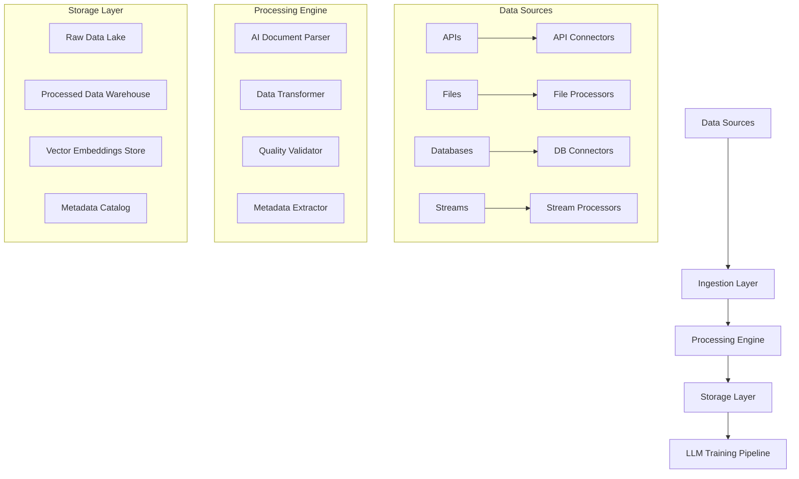

# 🔄 Data Ingestion Pipeline Architecture
updated: 01/20/25

## Project Overview
Designing a versatile, scalable data ingestion pipeline capable of handling diverse data sources across multiple industries (legal, insurance, healthcare, manufacturing) for custom LLM training and business intelligence.

## Current Implementation Status
**Implementation Phase**: Architectural Planning & Strategy

**Key Characteristics**:
- **Multi-Source Ingestion**: Support for files, APIs, databases, and real-time streams
- **Industry Agnostic**: Flexible adapters for legal, insurance, healthcare, and other verticals
- **AI-Powered Processing**: LLM-assisted data extraction, classification, and structuring
- **Scalable Architecture**: Handle TB-scale datasets with parallel processing
- **Data Quality Assurance**: Automated validation, deduplication, and error handling

---

## 🎯 Use Case Analysis

### Legal Firm Scenario
**Data Sources:**
- **Document Repository**: PDFs (contracts, briefs, case files, precedents)
- **Case Management Systems**: Clio, MyCase, PracticePanther APIs
- **Email Archives**: Outlook/Gmail exports with client communications
- **Court Records**: PACER integration, state court systems
- **Time Tracking**: Billable hours and case activity logs
- **Knowledge Base**: Internal memos, legal research, firm protocols

**Processing Requirements:**
- **Document OCR**: Extract text from scanned legal documents
- **Metadata Extraction**: Case numbers, dates, parties, legal categories
- **Privilege Detection**: Identify attorney-client privileged information
- **Entity Recognition**: Extract names, dates, case references, legal citations
- **Classification**: Categorize by practice area, case type, document type

### Insurance Company Scenario
**Data Sources:**
- **Policy Management**: Guidewire, Duck Creek, Majesco APIs
- **Claims Processing**: ImageRight, ClaimCenter, external adjuster systems
- **Customer Data**: Salesforce CRM, customer portals, call center logs
- **Risk Assessment**: Verisk Analytics, ISO data feeds
- **Financial Systems**: SAP, Oracle ERP integrations
- **Regulatory Filings**: NAIC data, state insurance commissioner reports

**Processing Requirements:**
- **Structured Data ETL**: Extract from SQL databases and APIs
- **Unstructured Processing**: Claims photos, medical records, repair estimates
- **Compliance Mapping**: Ensure data handling meets insurance regulations
- **Risk Scoring**: Calculate and update risk metrics
- **Time-Series Processing**: Handle premium calculations, claims trends

### Manufacturing Company Scenario
**Data Sources:**
- **ERP Systems**: SAP, Oracle, Microsoft Dynamics APIs
- **IoT Sensors**: Machine telemetry, environmental monitoring
- **Quality Systems**: SPC data, inspection reports, compliance records
- **Supply Chain**: EDI transactions, vendor portals, logistics APIs
- **HR Systems**: Workday, BambooHR for workforce analytics
- **Financial Data**: Cost accounting, inventory management

---

## 🏗️ Pipeline Architecture Overview

### Core Components Architecture



### Data Flow Strategy

#### 1. **Multi-Modal Ingestion Layer**
```typescript
// Universal data connector interface
interface DataConnector {
  sourceType: 'api' | 'file' | 'database' | 'stream';
  authenticate(): Promise<boolean>;
  extract(config: ExtractionConfig): AsyncGenerator<DataChunk>;
  validate(data: DataChunk): ValidationResult;
  transform(data: DataChunk): ProcessedData;
}

// Industry-specific connector implementations
class LegalDocumentConnector implements DataConnector {
  sourceType = 'file';
  
  async extract(config: ExtractionConfig) {
    for (const filePath of config.filePaths) {
      if (filePath.endsWith('.pdf')) {
        const extractedText = await this.ocrProcessor.extractText(filePath);
        const legalMetadata = await this.extractLegalMetadata(extractedText);
        
        yield {
          content: extractedText,
          metadata: legalMetadata,
          source: filePath,
          timestamp: new Date()
        };
      }
    }
  }
  
  private async extractLegalMetadata(text: string) {
    const llmProcessor = new LegalLLMProcessor();
    return await llmProcessor.extractStructuredData(text, {
      caseNumber: true,
      parties: true,
      courtJurisdiction: true,
      practiceArea: true,
      privilegeFlags: true
    });
  }
}

class InsuranceAPIConnector implements DataConnector {
  sourceType = 'api';
  
  async extract(config: ExtractionConfig) {
    const policyData = await this.apiClient.getPolicies({
      dateRange: config.dateRange,
      status: 'active'
    });
    
    for (const policy of policyData) {
      const enrichedData = await this.enrichWithClaimsData(policy);
      
      yield {
        content: enrichedData,
        metadata: {
          policyNumber: policy.number,
          customerSegment: policy.segment,
          riskScore: policy.riskAssessment
        },
        source: `policy_${policy.number}`,
        timestamp: new Date()
      };
    }
  }
}
```

#### 2. **AI-Powered Document Processing**
```typescript
// LLM-assisted data extraction pipeline
class AIDocumentProcessor {
  private documentClassifier: LLMClassifier;
  private entityExtractor: LLMEntityExtractor;
  private structuralParser: LLMStructuralParser;
  
  async processDocument(document: RawDocument): Promise<ProcessedDocument> {
    // Step 1: Classify document type and industry context
    const classification = await this.documentClassifier.classify(document, {
      categories: ['legal_contract', 'insurance_policy', 'financial_report', 'technical_manual'],
      confidence_threshold: 0.8
    });
    
    // Step 2: Extract structured information based on classification
    const entities = await this.entityExtractor.extract(document, {
      schema: this.getSchemaForDocumentType(classification.type),
      extractionMode: 'comprehensive'
    });
    
    // Step 3: Parse document structure and relationships
    const structure = await this.structuralParser.parse(document, {
      hierarchical: true,
      cross_references: true,
      section_boundaries: true
    });
    
    return {
      originalContent: document.content,
      classification: classification,
      extractedEntities: entities,
      documentStructure: structure,
      processedAt: new Date(),
      qualityScore: this.calculateQualityScore(entities, structure)
    };
  }
  
  private getSchemaForDocumentType(documentType: string): ExtractionSchema {
    const schemas = {
      'legal_contract': {
        parties: 'array of legal entities',
        effective_date: 'date',
        termination_date: 'date',
        governing_law: 'jurisdiction',
        key_terms: 'array of contractual obligations',
        monetary_amounts: 'array of financial terms'
      },
      'insurance_policy': {
        policy_holder: 'person or entity',
        coverage_details: 'array of coverage types',
        premium_amount: 'monetary value',
        deductibles: 'array of deductible amounts',
        exclusions: 'array of excluded coverages',
        effective_period: 'date range'
      }
      // ... other schemas
    };
    
    return schemas[documentType] || schemas['default'];
  }
}
```

---

## 🔌 Connector Strategy for Different Data Sources

### API-Based Integrations

#### Enterprise Software Connectors
```typescript
// Modular API connector framework
class APIConnectorFactory {
  static createConnector(system: string, config: APIConfig): APIConnector {
    const connectors = {
      'salesforce': new SalesforceConnector(config),
      'microsoft_dynamics': new DynamicsConnector(config),
      'sap': new SAPConnector(config),
      'workday': new WorkdayConnector(config),
      'guidewire': new GuidewireConnector(config),
      'clio': new ClioConnector(config),
      // ... expandable for any API
    };
    
    return connectors[system] || new GenericRESTConnector(config);
  }
}

// Example: Insurance-specific Guidewire connector
class GuidewireConnector implements APIConnector {
  private baseUrl: string;
  private authToken: string;
  
  async extractPolicyData(filters: PolicyFilters): Promise<PolicyData[]> {
    const endpoint = `${this.baseUrl}/pc/rest/common/v1/policies`;
    
    const response = await this.authenticatedRequest(endpoint, {
      method: 'GET',
      params: {
        effectiveDate: filters.dateRange.start,
        expirationDate: filters.dateRange.end,
        status: filters.status
      }
    });
    
    return response.data.map(policy => this.transformPolicyData(policy));
  }
  
  async extractClaimsData(policyNumbers: string[]): Promise<ClaimData[]> {
    const endpoint = `${this.baseUrl}/cc/rest/common/v1/claims`;
    
    const claims = await Promise.all(
      policyNumbers.map(policyNum => 
        this.authenticatedRequest(`${endpoint}?policyNumber=${policyNum}`)
      )
    );
    
    return claims.flat().map(claim => this.transformClaimData(claim));
  }
  
  private transformPolicyData(rawPolicy: any): PolicyData {
    return {
      policyNumber: rawPolicy.PolicyNumber,
      holderName: rawPolicy.NamedInsured?.DisplayName,
      effectiveDate: new Date(rawPolicy.EffectiveDate),
      expirationDate: new Date(rawPolicy.ExpirationDate),
      coverages: rawPolicy.RiskUnits?.map(unit => ({
        type: unit.CoverageType,
        limit: unit.CoverageLimit,
        deductible: unit.Deductible
      })),
      premium: {
        base: rawPolicy.BasePremium,
        total: rawPolicy.TotalPremium,
        taxes: rawPolicy.TaxesAndFees
      }
    };
  }
}
```

### File-Based Processing

#### Multi-Format File Processor
```typescript
class FileProcessingEngine {
  private processors: Map<string, FileProcessor> = new Map([
    ['pdf', new PDFProcessor()],
    ['docx', new WordDocProcessor()],
    ['xlsx', new ExcelProcessor()],
    ['csv', new CSVProcessor()],
    ['json', new JSONProcessor()],
    ['xml', new XMLProcessor()],
    ['eml', new EmailProcessor()],
    ['msg', new OutlookMsgProcessor()]
  ]);
  
  async processFile(filePath: string): Promise<ProcessedFileData> {
    const fileExtension = path.extname(filePath).toLowerCase().substring(1);
    const processor = this.processors.get(fileExtension);
    
    if (!processor) {
      throw new Error(`No processor available for file type: ${fileExtension}`);
    }
    
    const rawData = await processor.extract(filePath);
    const aiProcessedData = await this.enhanceWithAI(rawData, fileExtension);
    
    return {
      originalFile: filePath,
      fileType: fileExtension,
      extractedContent: rawData,
      aiEnhancedData: aiProcessedData,
      processingMetadata: {
        processedAt: new Date(),
        processingVersion: '1.0',
        qualityScore: this.assessQuality(aiProcessedData)
      }
    };
  }
  
  private async enhanceWithAI(rawData: RawFileData, fileType: string): Promise<AIEnhancedData> {
    const aiProcessor = new DocumentAIProcessor();
    
    switch (fileType) {
      case 'pdf':
        return await aiProcessor.processPDF(rawData, {
          extractTables: true,
          identifyFormFields: true,
          recognizeSignatures: true,
          extractMetadata: true
        });
        
      case 'xlsx':
        return await aiProcessor.processSpreadsheet(rawData, {
          identifyDataTables: true,
          recognizeFormulas: true,
          extractChartData: true,
          classifyWorksheets: true
        });
        
      default:
        return await aiProcessor.processGenericDocument(rawData);
    }
  }
}
```

### Database Integration Strategy

#### Multi-Database Connector
```typescript
class DatabaseConnectorManager {
  private connections: Map<string, DatabaseConnection> = new Map();
  
  async createConnection(config: DatabaseConfig): Promise<string> {
    const connectionId = `${config.type}_${config.host}_${config.database}`;
    
    const connector = this.createConnectorByType(config.type);
    await connector.connect(config);
    
    this.connections.set(connectionId, connector);
    return connectionId;
  }
  
  async extractData(connectionId: string, query: DataQuery): Promise<ExtractedData[]> {
    const connection = this.connections.get(connectionId);
    if (!connection) throw new Error(`Connection ${connectionId} not found`);
    
    const rawData = await connection.executeQuery(query);
    
    // Apply AI-powered data enhancement
    const enhancedData = await this.enhanceWithBusinessLogic(rawData, query.context);
    
    return enhancedData;
  }
  
  private createConnectorByType(type: string): DatabaseConnector {
    const connectorMap = {
      'postgresql': new PostgreSQLConnector(),
      'mysql': new MySQLConnector(),
      'sqlserver': new SQLServerConnector(),
      'oracle': new OracleConnector(),
      'mongodb': new MongoDBConnector(),
      'snowflake': new SnowflakeConnector(),
      'redshift': new RedshiftConnector()
    };
    
    return connectorMap[type] || new GenericSQLConnector();
  }
  
  private async enhanceWithBusinessLogic(rawData: any[], context: QueryContext): Promise<ExtractedData[]> {
    const aiEnhancer = new BusinessLogicAI();
    
    return await Promise.all(rawData.map(async (record) => {
      const enhancement = await aiEnhancer.enhanceRecord(record, {
        industry: context.industry,
        dataType: context.expectedDataType,
        businessRules: context.businessRules
      });
      
      return {
        originalData: record,
        enhancedData: enhancement.structuredData,
        businessInsights: enhancement.insights,
        dataQuality: enhancement.qualityMetrics
      };
    }));
  }
}
```

---

## 📊 Data Processing and Transformation Pipeline

### Multi-Stage Processing Architecture

#### Stage 1: Raw Data Ingestion
```typescript
class DataIngestionOrchestrator {
  private ingestionQueue: Queue<IngestionJob>;
  private processors: Map<string, DataProcessor>;
  
  async scheduleIngestion(sources: DataSource[]): Promise<string> {
    const jobId = generateUUID();
    
    const ingestionJob: IngestionJob = {
      id: jobId,
      sources: sources,
      priority: this.calculatePriority(sources),
      estimatedProcessingTime: this.estimateProcessingTime(sources),
      scheduledAt: new Date()
    };
    
    await this.ingestionQueue.add(ingestionJob);
    return jobId;
  }
  
  async processIngestionJob(job: IngestionJob): Promise<IngestionResult> {
    const results: SourceProcessingResult[] = [];
    
    // Process sources in parallel with concurrency control
    const concurrencyLimit = this.calculateOptimalConcurrency(job.sources);
    
    await Promise.map(job.sources, async (source) => {
      const processor = this.getProcessorForSource(source);
      const result = await processor.process(source);
      
      results.push({
        sourceId: source.id,
        status: result.success ? 'completed' : 'failed',
        recordsProcessed: result.recordCount,
        errors: result.errors,
        processingTime: result.duration
      });
    }, { concurrency: concurrencyLimit });
    
    return {
      jobId: job.id,
      overallStatus: this.determineOverallStatus(results),
      sourceResults: results,
      totalRecordsProcessed: results.reduce((sum, r) => sum + r.recordsProcessed, 0),
      completedAt: new Date()
    };
  }
}
```

#### Stage 2: AI-Powered Data Enhancement
```typescript
class AIDataEnhancementEngine {
  private embeddingGenerator: EmbeddingGenerator;
  private entityExtractor: EntityExtractor;
  private relationshipMapper: RelationshipMapper;
  
  async enhanceDataBatch(rawData: RawDataBatch): Promise<EnhancedDataBatch> {
    const enhancedRecords = await Promise.all(
      rawData.records.map(record => this.enhanceSingleRecord(record))
    );
    
    // Post-processing: identify cross-record relationships
    const relationships = await this.relationshipMapper.findRelationships(enhancedRecords);
    
    return {
      originalBatch: rawData,
      enhancedRecords: enhancedRecords,
      discoveredRelationships: relationships,
      batchMetadata: {
        enhancementVersion: '1.0',
        processingTimestamp: new Date(),
        qualityScore: this.calculateBatchQuality(enhancedRecords)
      }
    };
  }
  
  private async enhanceSingleRecord(record: RawDataRecord): Promise<EnhancedDataRecord> {
    // Step 1: Extract entities and relationships
    const entities = await this.entityExtractor.extract(record.content, {
      entityTypes: this.getEntityTypesForIndustry(record.industry),
      confidenceThreshold: 0.75
    });
    
    // Step 2: Generate embeddings for semantic search
    const embeddings = await this.embeddingGenerator.generateEmbeddings(record.content, {
      model: 'text-embedding-ada-002',
      chunkStrategy: 'semantic_paragraphs'
    });
    
    // Step 3: Classify and categorize content
    const classification = await this.classifyContent(record.content, record.industry);
    
    // Step 4: Extract key insights and summary
    const insights = await this.generateInsights(record.content, {
      industry: record.industry,
      contentType: classification.type,
      extractionDepth: 'comprehensive'
    });
    
    return {
      originalRecord: record,
      extractedEntities: entities,
      contentEmbeddings: embeddings,
      classification: classification,
      insights: insights,
      processingMetadata: {
        processedAt: new Date(),
        processingModel: 'gpt-4-turbo',
        qualityScore: this.calculateRecordQuality(entities, insights)
      }
    };
  }
}
```

#### Stage 3: Data Quality and Validation
```typescript
class DataQualityAssurance {
  private validationRules: Map<string, ValidationRule[]>;
  private deduplicationEngine: DeduplicationEngine;
  
  async validateAndCleanData(enhancedData: EnhancedDataBatch): Promise<ValidatedDataBatch> {
    // Step 1: Apply industry-specific validation rules
    const validationResults = await this.applyValidationRules(enhancedData);
    
    // Step 2: Identify and handle duplicates
    const deduplicationResults = await this.deduplicationEngine.process(enhancedData.enhancedRecords);
    
    // Step 3: Data quality scoring and flagging
    const qualityAssessment = await this.assessDataQuality(enhancedData, validationResults);
    
    // Step 4: Apply data cleaning and standardization
    const cleanedData = await this.applyDataCleaning(enhancedData, validationResults);
    
    return {
      originalData: enhancedData,
      validationResults: validationResults,
      deduplicationResults: deduplicationResults,
      qualityAssessment: qualityAssessment,
      cleanedData: cleanedData,
      recommendedActions: this.generateRecommendations(qualityAssessment)
    };
  }
  
  private async applyValidationRules(data: EnhancedDataBatch): Promise<ValidationResult[]> {
    const industry = data.originalBatch.industry;
    const rules = this.validationRules.get(industry) || [];
    
    return await Promise.all(
      data.enhancedRecords.map(async (record) => {
        const ruleResults = await Promise.all(
          rules.map(rule => rule.validate(record))
        );
        
        return {
          recordId: record.originalRecord.id,
          overallStatus: this.determineValidationStatus(ruleResults),
          ruleResults: ruleResults,
          criticalIssues: ruleResults.filter(r => r.severity === 'critical'),
          warnings: ruleResults.filter(r => r.severity === 'warning')
        };
      })
    );
  }
}
```

---

## 🏢 Industry-Specific Adaptations

### Legal Industry Pipeline
```typescript
class LegalDataPipeline {
  private privilegeChecker: PrivilegeChecker;
  private citationExtractor: CitationExtractor;
  private redactionEngine: RedactionEngine;
  
  async processLegalDocuments(documents: Document[]): Promise<ProcessedLegalData[]> {
    const results = [];
    
    for (const doc of documents) {
      // Step 1: Check for attorney-client privilege
      const privilegeCheck = await this.privilegeChecker.analyze(doc.content);
      
      // Step 2: Extract legal citations and references
      const citations = await this.citationExtractor.extractCitations(doc.content);
      
      // Step 3: Identify key legal concepts and entities
      const legalEntities = await this.extractLegalEntities(doc.content);
      
      // Step 4: Apply redaction if necessary
      let processedContent = doc.content;
      if (privilegeCheck.requiresRedaction) {
        processedContent = await this.redactionEngine.redact(doc.content, privilegeCheck.sensitiveTerms);
      }
      
      results.push({
        originalDocument: doc,
        privilegeStatus: privilegeCheck,
        extractedCitations: citations,
        legalEntities: legalEntities,
        processedContent: processedContent,
        legalMetadata: {
          practiceArea: await this.classifyPracticeArea(doc.content),
          documentType: await this.classifyLegalDocumentType(doc.content),
          urgency: await this.assessUrgency(doc.content),
          jurisdiction: legalEntities.jurisdictions
        }
      });
    }
    
    return results;
  }
}
```

### Insurance Industry Pipeline
```typescript
class InsuranceDataPipeline {
  private riskAnalyzer: RiskAnalyzer;
  private claimsProcessor: ClaimsProcessor;
  private policyAnalyzer: PolicyAnalyzer;
  
  async processInsuranceData(data: InsuranceRawData[]): Promise<ProcessedInsuranceData[]> {
    const results = [];
    
    for (const record of data) {
      let processedData: ProcessedInsuranceData;
      
      switch (record.type) {
        case 'policy':
          processedData = await this.processPolicyData(record);
          break;
        case 'claim':
          processedData = await this.processClaimData(record);
          break;
        case 'customer':
          processedData = await this.processCustomerData(record);
          break;
        default:
          processedData = await this.processGenericInsuranceData(record);
      }
      
      // Apply industry-specific risk analysis
      const riskAssessment = await this.riskAnalyzer.analyzeRecord(processedData);
      processedData.riskMetrics = riskAssessment;
      
      results.push(processedData);
    }
    
    return results;
  }
  
  private async processPolicyData(policyData: PolicyRawData): Promise<ProcessedPolicyData> {
    const analysis = await this.policyAnalyzer.analyze(policyData);
    
    return {
      originalData: policyData,
      normalizedPolicy: analysis.normalizedData,
      coverageAnalysis: analysis.coverageBreakdown,
      riskFactors: analysis.identifiedRiskFactors,
      pricingAnalysis: analysis.pricingMetrics,
      complianceFlags: analysis.complianceIssues
    };
  }
}
```

---

## 🔄 Real-Time vs Batch Processing Strategy

### Hybrid Processing Architecture
```typescript
class ProcessingOrchestrator {
  private batchProcessor: BatchProcessor;
  private streamProcessor: StreamProcessor;
  private processingRules: ProcessingRuleEngine;
  
  async determineProcessingStrategy(dataSource: DataSource): Promise<ProcessingStrategy> {
    const characteristics = await this.analyzeDataSource(dataSource);
    
    return {
      primaryMode: this.selectPrimaryMode(characteristics),
      fallbackMode: this.selectFallbackMode(characteristics),
      triggerConditions: this.defineTriggerConditions(characteristics),
      performance: this.estimatePerformance(characteristics)
    };
  }
  
  private selectPrimaryMode(characteristics: DataSourceCharacteristics): ProcessingMode {
    const {
      volume,
      velocity,
      latencyRequirement,
      dataComplexity,
      availabilityWindow
    } = characteristics;
    
    // Real-time processing criteria
    if (latencyRequirement < 5000 && velocity > 100) { // < 5s latency, > 100 records/min
      return 'real-time';
    }
    
    // Near real-time processing criteria  
    if (latencyRequirement < 300000 && velocity > 10) { // < 5min latency, > 10 records/min
      return 'near-real-time';
    }
    
    // Batch processing for everything else
    return 'batch';
  }
}

// Real-time processing for high-priority data
class StreamProcessor {
  private kafkaConsumer: KafkaConsumer;
  private aiProcessor: AIStreamProcessor;
  
  async processStream(streamConfig: StreamConfig): Promise<void> {
    this.kafkaConsumer.subscribe(streamConfig.topics);
    
    this.kafkaConsumer.on('message', async (message) => {
      try {
        const data = JSON.parse(message.value.toString());
        
        // Quick classification to determine processing path
        const classification = await this.aiProcessor.quickClassify(data);
        
        if (classification.priority === 'high') {
          await this.processHighPriorityData(data);
        } else {
          await this.queueForBatchProcessing(data);
        }
        
        // Commit offset after successful processing
        this.kafkaConsumer.commitSync();
        
      } catch (error) {
        console.error('Stream processing error:', error);
        await this.handleStreamProcessingError(error, message);
      }
    });
  }
}
```

---

## 💾 Storage Strategy and Data Lake Architecture

### Multi-Layer Storage Design
```typescript
class DataStorageManager {
  private rawDataLake: S3Client;
  private processedDataWarehouse: PostgreSQLClient;
  private vectorStore: PineconeClient;
  private metadataStore: MongoDBClient;
  
  async storeProcessedData(data: ProcessedDataBatch): Promise<StorageResult> {
    const storageOperations = [];
    
    // Layer 1: Raw data backup (S3/MinIO)
    storageOperations.push(
      this.rawDataLake.store({
        bucket: 'raw-data-archive',
        key: `${data.industry}/${data.batchId}/${Date.now()}.json`,
        data: data.originalData,
        metadata: {
          source: data.source,
          ingestionDate: new Date(),
          retentionPolicy: 'long-term'
        }
      })
    );
    
    // Layer 2: Structured data (PostgreSQL/Snowflake)
    storageOperations.push(
      this.processedDataWarehouse.bulkInsert({
        table: `${data.industry}_processed_data`,
        data: data.structuredRecords,
        onConflict: 'update',
        indexes: ['source_id', 'processed_date', 'content_hash']
      })
    );
    
    // Layer 3: Vector embeddings (Pinecone/Chroma)
    storageOperations.push(
      this.vectorStore.upsert({
        namespace: data.industry,
        vectors: data.embeddings.map(embedding => ({
          id: embedding.recordId,
          values: embedding.vector,
          metadata: {
            source: embedding.source,
            contentType: embedding.contentType,
            timestamp: embedding.timestamp
          }
        }))
      })
    );
    
    // Layer 4: Metadata and relationships (MongoDB/DocumentDB)
    storageOperations.push(
      this.metadataStore.insertMany({
        collection: 'data_lineage',
        documents: data.records.map(record => ({
          recordId: record.id,
          sourceMetadata: record.sourceMetadata,
          processingMetadata: record.processingMetadata,
          relationships: record.discoveredRelationships,
          qualityScore: record.qualityScore
        }))
      })
    );
    
    const results = await Promise.allSettled(storageOperations);
    
    return {
      success: results.every(r => r.status === 'fulfilled'),
      layerResults: {
        rawDataLake: results[0],
        dataWarehouse: results[1],
        vectorStore: results[2],
        metadataStore: results[3]
      },
      storedRecordCount: data.records.length
    };
  }
}
```

---

## ⚙️ Configuration and Deployment Strategy

### Flexible Configuration System
```typescript
// Industry-specific configuration templates
const industryConfigs = {
  legal: {
    dataSources: {
      documentTypes: ['pdf', 'docx', 'txt', 'eml'],
      apiIntegrations: ['clio', 'mycase', 'practicepanther'],
      requiredConnectors: ['document_processor', 'case_management_api', 'email_processor']
    },
    processing: {
      aiModels: {
        entityExtraction: 'legal-entities-v2',
        classification: 'legal-document-classifier',
        privilegeDetection: 'attorney-client-privilege-detector'
      },
      validationRules: ['privilege_check', 'citation_validation', 'jurisdiction_compliance']
    },
    storage: {
      encryptionRequired: true,
      retentionPeriod: '7_years',
      complianceStandards: ['bar_association', 'hipaa_if_applicable']
    }
  },
  
  insurance: {
    dataSources: {
      apiIntegrations: ['guidewire', 'duck_creek', 'majesco'],
      databaseConnections: ['policy_db', 'claims_db', 'customer_db'],
      externalFeeds: ['verisk_analytics', 'iso_data']
    },
    processing: {
      aiModels: {
        riskAssessment: 'insurance-risk-analyzer',
        claimsProcessing: 'claims-classifier',
        fraudDetection: 'fraud-detection-model'
      },
      validationRules: ['policy_validation', 'claims_integrity', 'regulatory_compliance']
    },
    storage: {
      regulatoryCompliance: ['sox', 'state_insurance_regulations'],
      dataResidency: 'required_by_jurisdiction'
    }
  }
};

class PipelineDeploymentManager {
  async deployForIndustry(industry: string, clientConfig: ClientConfig): Promise<DeploymentResult> {
    const baseConfig = industryConfigs[industry];
    const mergedConfig = this.mergeConfigurations(baseConfig, clientConfig);
    
    // Deploy connectors based on client's systems
    const connectors = await this.deployConnectors(mergedConfig.dataSources);
    
    // Configure AI processing pipeline
    const processingPipeline = await this.configurePipeline(mergedConfig.processing);
    
    // Set up storage with appropriate compliance measures
    const storage = await this.configureStorage(mergedConfig.storage);
    
    return {
      deploymentId: generateDeploymentId(),
      connectors: connectors,
      pipeline: processingPipeline,
      storage: storage,
      monitoringEndpoints: await this.setupMonitoring(mergedConfig)
    };
  }
}
```

---

## 📈 Monitoring and Quality Assurance

### Pipeline Health Monitoring
```typescript
class PipelineMonitor {
  private metricsCollector: MetricsCollector;
  private alertingSystem: AlertingSystem;
  
  async monitorPipelineHealth(): Promise<void> {
    setInterval(async () => {
      const healthMetrics = await this.collectHealthMetrics();
      await this.evaluateHealthThresholds(healthMetrics);
    }, 30000); // Check every 30 seconds
  }
  
  private async collectHealthMetrics(): Promise<PipelineHealthMetrics> {
    return {
      ingestionRate: await this.metricsCollector.getIngestionRate(),
      processingLatency: await this.metricsCollector.getProcessingLatency(),
      errorRate: await this.metricsCollector.getErrorRate(),
      dataQualityScore: await this.metricsCollector.getDataQualityScore(),
      resourceUtilization: await this.metricsCollector.getResourceUtilization(),
      storageMetrics: await this.metricsCollector.getStorageMetrics()
    };
  }
  
  private async evaluateHealthThresholds(metrics: PipelineHealthMetrics): Promise<void> {
    const thresholds = {
      maxProcessingLatency: 300000, // 5 minutes
      maxErrorRate: 0.05, // 5%
      minDataQualityScore: 0.8, // 80%
      maxResourceUtilization: 0.9 // 90%
    };
    
    if (metrics.processingLatency > thresholds.maxProcessingLatency) {
      await this.alertingSystem.sendAlert({
        severity: 'high',
        message: 'Processing latency exceeded threshold',
        currentValue: metrics.processingLatency,
        threshold: thresholds.maxProcessingLatency
      });
    }
    
    if (metrics.errorRate > thresholds.maxErrorRate) {
      await this.alertingSystem.sendAlert({
        severity: 'critical',
        message: 'Error rate exceeded acceptable threshold',
        currentValue: metrics.errorRate,
        threshold: thresholds.maxErrorRate
      });
    }
  }
}
```

---

## 🚀 Implementation Roadmap

### Phase 1: Core Framework (Weeks 1-4)
- [ ] **Multi-connector architecture** - Build base connector interfaces
- [ ] **AI document processor** - Implement LLM-powered extraction
- [ ] **Basic storage layers** - Set up data lake and warehouse
- [ ] **Configuration system** - Industry-specific templates

### Phase 2: Industry Specialization (Weeks 5-8)
- [ ] **Legal pipeline** - Privilege detection, citation extraction
- [ ] **Insurance pipeline** - Risk analysis, policy processing
- [ ] **Quality assurance** - Validation rules and data cleaning
- [ ] **Monitoring system** - Health metrics and alerting

### Phase 3: Scale and Optimization (Weeks 9-12)
- [ ] **Stream processing** - Real-time data ingestion
- [ ] **Performance optimization** - Parallel processing, caching
- [ ] **Advanced AI features** - Relationship mapping, insights
- [ ] **Enterprise deployment** - Docker, Kubernetes, monitoring

### Phase 4: Advanced Features (Weeks 13-16)
- [ ] **Custom connector builder** - GUI for non-technical users
- [ ] **Data lineage tracking** - Full audit trail capabilities
- [ ] **Advanced analytics** - Automated insight generation
- [ ] **Multi-tenant architecture** - Client isolation and security

---

This comprehensive data ingestion pipeline architecture provides the flexibility to handle diverse data sources across industries while maintaining high performance, data quality, and security standards. The modular design allows for easy extension and customization based on specific client needs.
