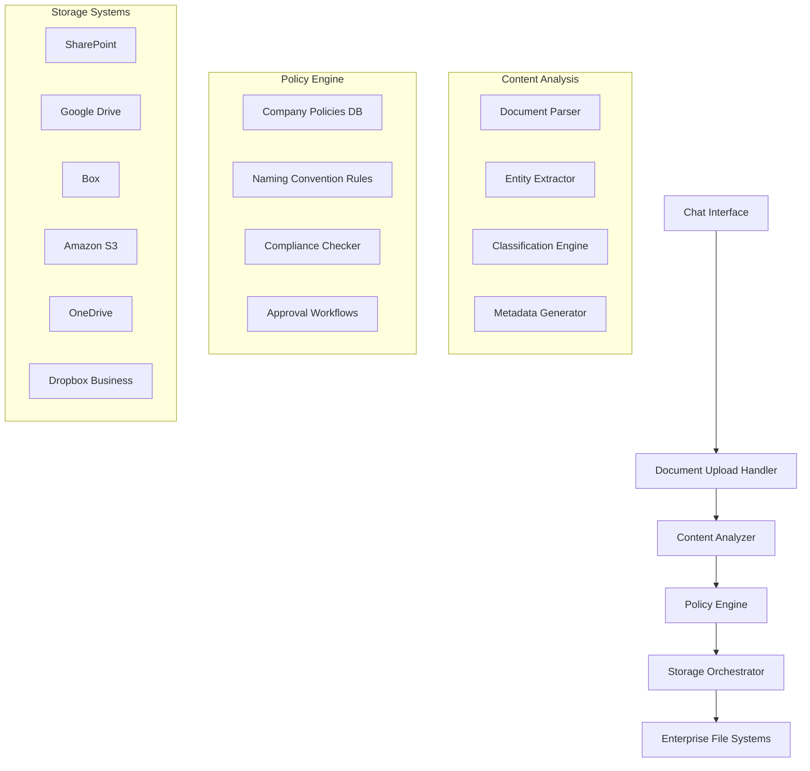

# 📁 Intelligent Document Management System
updated: 01/20/25

## Project Overview
Designing an AI-powered document management system that enables users to upload documents through a chat interface, where the LLM automatically determines appropriate storage locations, file naming conventions, and organizational structure based on company policies and document content analysis.

## Current Implementation Status
**Implementation Phase**: Conceptual Planning & Architecture Brainstorming

**Key Characteristics**:
- **Context-Aware File Organization**: LLM analyzes document content and company policies for intelligent placement
- **Universal Storage Integration**: Compatible with enterprise file systems (SharePoint, Google Drive, S3, Box, etc.)
- **Natural Language Interaction**: Chat-based document upload and organization
- **Policy-Driven Automation**: Configurable rules for different industries and company structures
- **Audit Trail & Compliance**: Full tracking of document placement decisions and modifications

---

## 🎯 Core Functionality Vision

### User Experience Flow

#### Step 1: Document Upload via Chat
```
User: "I need to file this contract with ABC Corp for the Q1 marketing campaign"
[Uploads: Marketing_Contract_Draft.pdf]

AI Assistant: "I've analyzed the contract. Based on your company's filing system, this should be stored in:
📁 /Legal/Contracts/2025/Q1/Marketing/ABC_Corp/
📋 Suggested filename: 2025-01-20_Marketing-Contract_ABC-Corp_Q1-Campaign_DRAFT.pdf

This follows your legal department's naming convention: [Date]_[DocumentType]_[Client]_[Project]_[Status].pdf

Should I proceed with filing it there, or would you prefer a different location?"
```

#### Step 2: Intelligent Analysis & Suggestions
- **Content Analysis**: Extract contract details, parties, dates, project info
- **Policy Matching**: Apply company-specific filing rules and naming conventions
- **Context Understanding**: Leverage conversation history and user permissions
- **Compliance Checking**: Ensure placement meets regulatory requirements

#### Step 3: Automated Filing with Confirmation
- **Storage Integration**: Save to appropriate enterprise system
- **Metadata Enrichment**: Add searchable tags and properties
- **Notification System**: Inform relevant stakeholders
- **Audit Logging**: Record all decisions and actions taken

### Advanced Scenarios

#### Multi-Document Projects
```
User: "I have 5 documents related to the Johnson acquisition deal"
[Uploads: NDA.pdf, Financial_Analysis.xlsx, Legal_Opinion.docx, Due_Diligence.pdf, Term_Sheet.pdf]

AI Assistant: "I've identified this as an acquisition deal for Johnson Company. I'll organize these documents in:
📁 /Corporate/M&A/2025/Johnson-Acquisition/

Proposed structure:
├── 01-Legal/
│   ├── 2025-01-20_NDA_Johnson-Acquisition_EXECUTED.pdf
│   └── 2025-01-18_Legal-Opinion_Johnson-Acquisition_FINAL.docx
├── 02-Financial/
│   └── 2025-01-19_Financial-Analysis_Johnson-Acquisition_v2.xlsx
├── 03-Due-Diligence/
│   └── 2025-01-17_Due-Diligence-Report_Johnson-Acquisition_CONFIDENTIAL.pdf
└── 04-Terms/
    └── 2025-01-20_Term-Sheet_Johnson-Acquisition_DRAFT.pdf

This follows your M&A policy requiring separate folders by document type. Shall I proceed?"
```

---

## 🏗️ Technical Architecture

### System Components Overview



### Core Implementation Framework

#### Document Analysis Engine
```typescript
interface DocumentAnalysisResult {
  documentType: string;
  classification: DocumentClassification;
  extractedEntities: Entity[];
  suggestedPath: string;
  suggestedFilename: string;
  confidenceScore: number;
  requiredApprovals: string[];
  complianceFlags: ComplianceFlag[];
}

class IntelligentDocumentAnalyzer {
  private contentParser: DocumentContentParser;
  private entityExtractor: EntityExtractor;
  private classificationModel: DocumentClassifier;
  private policyEngine: PolicyEngine;

  async analyzeDocument(
    file: UploadedFile, 
    context: UserContext, 
    conversationHistory: ChatMessage[]
  ): Promise<DocumentAnalysisResult> {
    
    // Step 1: Parse document content
    const parsedContent = await this.contentParser.parse(file);
    
    // Step 2: Extract entities and metadata
    const entities = await this.entityExtractor.extract(parsedContent.text, {
      entityTypes: ['person', 'organization', 'date', 'contract_type', 'project_name'],
      context: conversationHistory
    });
    
    // Step 3: Classify document type
    const classification = await this.classificationModel.classify(parsedContent, {
      industryContext: context.companyIndustry,
      departmentContext: context.userDepartment
    });
    
    // Step 4: Apply company policies
    const policyRecommendations = await this.policyEngine.getStorageRecommendations({
      documentType: classification.type,
      entities: entities,
      userContext: context,
      contentSummary: parsedContent.summary
    });
    
    // Step 5: Generate file path and naming
    const pathAndName = await this.generatePathAndFilename(
      classification, 
      entities, 
      policyRecommendations, 
      file.originalName
    );
    
    return {
      documentType: classification.type,
      classification: classification,
      extractedEntities: entities,
      suggestedPath: pathAndName.path,
      suggestedFilename: pathAndName.filename,
      confidenceScore: this.calculateConfidence([classification, entities, policyRecommendations]),
      requiredApprovals: policyRecommendations.requiredApprovals,
      complianceFlags: policyRecommendations.complianceFlags
    };
  }
}
```

#### Policy Engine Implementation
```typescript
interface CompanyPolicy {
  id: string;
  name: string;
  description: string;
  industry: string;
  department?: string;
  rules: PolicyRule[];
  namingConvention: NamingConvention;
  storageStructure: StorageStructure;
  approvalWorkflows: ApprovalWorkflow[];
}

interface PolicyRule {
  condition: PolicyCondition;
  action: PolicyAction;
  priority: number;
  mandatory: boolean;
}

class PolicyEngine {
  private policies: Map<string, CompanyPolicy[]> = new Map();
  
  async getStorageRecommendations(context: PolicyContext): Promise<PolicyRecommendations> {
    const applicablePolicies = this.findApplicablePolicies(context);
    
    const recommendations: PolicyRecommendations = {
      suggestedPath: '',
      namingRules: [],
      requiredApprovals: [],
      complianceFlags: [],
      confidence: 0
    };
    
    // Apply policies in priority order
    for (const policy of applicablePolicies.sort((a, b) => b.priority - a.priority)) {
      const policyResult = await this.applyPolicy(policy, context);
      recommendations = this.mergePolicyResults(recommendations, policyResult);
    }
    
    return recommendations;
  }
  
  private findApplicablePolicies(context: PolicyContext): CompanyPolicy[] {
    const companyPolicies = this.policies.get(context.companyId) || [];
    
    return companyPolicies.filter(policy => {
      return this.evaluatePolicyConditions(policy, context);
    });
  }
}
```

#### Storage Orchestrator
```typescript
interface StorageAdapter {
  type: StorageType;
  authenticate(credentials: StorageCredentials): Promise<boolean>;
  createFolder(path: string): Promise<boolean>;
  uploadFile(file: File, path: string, metadata: FileMetadata): Promise<UploadResult>;
  checkPermissions(path: string, user: User): Promise<Permission[]>;
  setMetadata(filePath: string, metadata: FileMetadata): Promise<boolean>;
}

class UniversalStorageOrchestrator {
  private adapters: Map<StorageType, StorageAdapter> = new Map();
  
  constructor() {
    this.registerAdapters();
  }
  
  private registerAdapters(): void {
    this.adapters.set('sharepoint', new SharePointAdapter());
    this.adapters.set('googledrive', new GoogleDriveAdapter());
    this.adapters.set('box', new BoxAdapter());
    this.adapters.set('s3', new S3Adapter());
    this.adapters.set('onedrive', new OneDriveAdapter());
    this.adapters.set('dropbox', new DropboxAdapter());
  }
  
  async storeDocument(
    storageConfig: StorageConfiguration,
    file: ProcessedFile,
    analysis: DocumentAnalysisResult,
    userContext: UserContext
  ): Promise<StorageResult> {
    
    const adapter = this.adapters.get(storageConfig.type);
    if (!adapter) {
      throw new Error(`Storage adapter not found for type: ${storageConfig.type}`);
    }
    
    // Authenticate with storage system
    await adapter.authenticate(storageConfig.credentials);
    
    // Check user permissions
    const permissions = await adapter.checkPermissions(analysis.suggestedPath, userContext.user);
    if (!permissions.includes('write')) {
      throw new Error('Insufficient permissions to write to suggested path');
    }
    
    // Ensure folder structure exists
    await this.ensureFolderStructure(adapter, analysis.suggestedPath);
    
    // Prepare metadata
    const metadata = this.prepareFileMetadata(analysis, userContext);
    
    // Upload file
    const uploadResult = await adapter.uploadFile(
      file,
      analysis.suggestedPath + '/' + analysis.suggestedFilename,
      metadata
    );
    
    // Set additional metadata properties
    await adapter.setMetadata(uploadResult.filePath, metadata);
    
    return {
      success: true,
      finalPath: uploadResult.filePath,
      metadata: metadata,
      storageType: storageConfig.type
    };
  }
}
```

---

## 📂 Storage System Integrations

### Enterprise File System Support

#### Microsoft SharePoint Integration
```typescript
class SharePointAdapter implements StorageAdapter {
  private graphClient: Client;
  
  async authenticate(credentials: SharePointCredentials): Promise<boolean> {
    const authProvider = new ClientCredentialProvider(
      credentials.tenantId,
      credentials.clientId,
      credentials.clientSecret
    );
    
    this.graphClient = Client.initWithMiddleware({ authProvider });
    return true;
  }
  
  async createFolder(path: string): Promise<boolean> {
    const pathParts = path.split('/').filter(p => p.length > 0);
    let currentPath = '';
    
    for (const part of pathParts) {
      currentPath += '/' + part;
      
      try {
        await this.graphClient
          .api(`/sites/{site-id}/drive/root:${currentPath}`)
          .get();
      } catch (error) {
        if (error.code === 'itemNotFound') {
          await this.graphClient
            .api(`/sites/{site-id}/drive/root:${currentPath.substring(0, currentPath.lastIndexOf('/'))}:/children`)
            .post({
              name: part,
              folder: {}
            });
        }
      }
    }
    
    return true;
  }
  
  async uploadFile(file: File, path: string, metadata: FileMetadata): Promise<UploadResult> {
    const uploadSession = await this.graphClient
      .api(`/sites/{site-id}/drive/root:${path}:/createUploadSession`)
      .post({
        item: {
          '@microsoft.graph.conflictBehavior': 'rename',
          name: file.name
        }
      });
    
    // Upload file in chunks for large files
    const uploadResult = await this.uploadInChunks(file, uploadSession.uploadUrl);
    
    // Set custom metadata
    await this.setCustomProperties(uploadResult.id, metadata);
    
    return {
      success: true,
      filePath: path,
      fileId: uploadResult.id,
      url: uploadResult.webUrl
    };
  }
  
  private async setCustomProperties(itemId: string, metadata: FileMetadata): Promise<void> {
    const listItemId = await this.getListItemId(itemId);
    
    await this.graphClient
      .api(`/sites/{site-id}/lists/{list-id}/items/${listItemId}/fields`)
      .update({
        DocumentType: metadata.documentType,
        Department: metadata.department,
        Project: metadata.project,
        Classification: metadata.classification,
        Tags: metadata.tags.join(';')
      });
  }
}
```

#### Google Drive Integration
```typescript
class GoogleDriveAdapter implements StorageAdapter {
  private drive: drive_v3.Drive;
  
  async authenticate(credentials: GoogleDriveCredentials): Promise<boolean> {
    const auth = new google.auth.GoogleAuth({
      credentials: credentials.serviceAccount,
      scopes: ['https://www.googleapis.com/auth/drive']
    });
    
    this.drive = google.drive({ version: 'v3', auth });
    return true;
  }
  
  async uploadFile(file: File, path: string, metadata: FileMetadata): Promise<UploadResult> {
    const folderId = await this.ensureFolderPath(path);
    
    const fileMetadata = {
      name: file.name,
      parents: [folderId],
      properties: {
        documentType: metadata.documentType,
        department: metadata.department,
        project: metadata.project,
        uploadedBy: metadata.uploadedBy,
        uploadedAt: new Date().toISOString()
      }
    };
    
    const media = {
      mimeType: file.mimeType,
      body: file.stream
    };
    
    const response = await this.drive.files.create({
      requestBody: fileMetadata,
      media: media,
      fields: 'id,name,webViewLink'
    });
    
    return {
      success: true,
      filePath: path,
      fileId: response.data.id!,
      url: response.data.webViewLink!
    };
  }
  
  private async ensureFolderPath(path: string): Promise<string> {
    const pathParts = path.split('/').filter(p => p.length > 0);
    let currentFolderId = 'root';
    
    for (const folderName of pathParts) {
      currentFolderId = await this.getOrCreateFolder(folderName, currentFolderId);
    }
    
    return currentFolderId;
  }
}
```

#### Amazon S3 Integration
```typescript
class S3Adapter implements StorageAdapter {
  private s3Client: S3Client;
  
  async authenticate(credentials: S3Credentials): Promise<boolean> {
    this.s3Client = new S3Client({
      region: credentials.region,
      credentials: {
        accessKeyId: credentials.accessKeyId,
        secretAccessKey: credentials.secretAccessKey
      }
    });
    
    return true;
  }
  
  async uploadFile(file: File, path: string, metadata: FileMetadata): Promise<UploadResult> {
    const key = path + '/' + file.name;
    
    const command = new PutObjectCommand({
      Bucket: this.bucketName,
      Key: key,
      Body: file.buffer,
      ContentType: file.mimeType,
      Metadata: {
        documentType: metadata.documentType,
        department: metadata.department,
        project: metadata.project,
        uploadedBy: metadata.uploadedBy,
        uploadedAt: new Date().toISOString()
      },
      Tagging: this.buildTagString(metadata.tags)
    });
    
    await this.s3Client.send(command);
    
    return {
      success: true,
      filePath: key,
      fileId: key,
      url: `https://${this.bucketName}.s3.${this.region}.amazonaws.com/${key}`
    };
  }
}
```

---

## 🧠 AI-Powered File Organization

### Content Analysis and Classification

#### Document Type Classification
```typescript
class DocumentClassificationEngine {
  private classifierModel: LLMClassifier;
  
  async classifyDocument(content: ParsedDocument, context: ClassificationContext): Promise<DocumentClassification> {
    const prompt = this.buildClassificationPrompt(content, context);
    
    const response = await this.classifierModel.classify(prompt, {
      temperature: 0.1,
      responseFormat: 'structured_json',
      examples: this.getClassificationExamples(context.industry)
    });
    
    return {
      primaryType: response.document_type,
      subType: response.sub_type,
      category: response.category,
      confidenceScore: response.confidence,
      reasoningSteps: response.reasoning,
      suggestedHandling: response.handling_instructions
    };
  }
  
  private buildClassificationPrompt(content: ParsedDocument, context: ClassificationContext): string {
    return `
      Analyze this document and classify it according to the company's filing system.
      
      Company Context:
      - Industry: ${context.industry}
      - Department: ${context.department}
      - Common Document Types: ${context.commonDocumentTypes.join(', ')}
      
      Document Content Preview:
      ${content.summary}
      
      Key Extracted Information:
      ${JSON.stringify(content.extractedData, null, 2)}
      
      Please classify this document and explain your reasoning:
      1. What type of document is this?
      2. What category does it belong to?
      3. How should it be filed according to company policies?
      4. What metadata should be preserved?
      
      Respond in JSON format with the classification results.
    `;
  }
}
```

#### Entity Extraction for File Naming
```typescript
class FileNamingEngine {
  private entityExtractor: EntityExtractor;
  private namingPolicyEngine: NamingPolicyEngine;
  
  async generateFilename(
    originalName: string,
    analysis: DocumentAnalysisResult,
    policies: NamingPolicy[]
  ): Promise<GeneratedFilename> {
    
    // Extract key entities for naming
    const namingEntities = this.extractNamingEntities(analysis.extractedEntities);
    
    // Apply naming policies
    const applicablePolicy = this.selectBestNamingPolicy(policies, analysis.documentType);
    
    // Generate filename components
    const components = await this.generateFilenameComponents(
      namingEntities,
      applicablePolicy,
      originalName
    );
    
    // Construct final filename
    const filename = this.constructFilename(components, applicablePolicy.template);
    
    // Validate filename
    const validation = this.validateFilename(filename, applicablePolicy.constraints);
    
    if (!validation.isValid) {
      return this.generateFallbackFilename(originalName, analysis, validation.issues);
    }
    
    return {
      filename: filename,
      components: components,
      policy: applicablePolicy,
      confidence: this.calculateNamingConfidence(components, applicablePolicy)
    };
  }
  
  private generateFilenameComponents(
    entities: NamingEntity[],
    policy: NamingPolicy,
    originalName: string
  ): FilenameComponents {
    const components: FilenameComponents = {
      date: this.extractDateComponent(entities),
      documentType: this.extractDocumentType(entities, policy),
      organization: this.extractOrganization(entities),
      project: this.extractProject(entities),
      version: this.extractVersion(originalName, entities),
      status: this.extractStatus(entities),
      classification: this.extractClassification(entities)
    };
    
    // Clean and format components
    return this.formatComponents(components, policy.formatting);
  }
  
  private constructFilename(components: FilenameComponents, template: string): string {
    let filename = template;
    
    // Replace template variables with actual values
    const replacements = {
      '{date}': components.date || '',
      '{type}': components.documentType || '',
      '{org}': components.organization || '',
      '{project}': components.project || '',
      '{version}': components.version || '',
      '{status}': components.status || '',
      '{classification}': components.classification || ''
    };
    
    for (const [placeholder, value] of Object.entries(replacements)) {
      filename = filename.replace(new RegExp(placeholder, 'g'), value);
    }
    
    // Clean up filename (remove extra separators, spaces, etc.)
    return this.cleanFilename(filename);
  }
}
```

---

## 🏢 Industry-Specific Implementations

### Legal Industry Configuration
```typescript
const legalIndustryConfig: IndustryConfiguration = {
  industry: 'legal',
  documentTypes: [
    'contract', 'agreement', 'brief', 'motion', 'discovery', 
    'deposition', 'pleading', 'memo', 'opinion', 'correspondence'
  ],
  
  namingConventions: {
    contract: '{date}_{type}_{client}_{matter}_{status}.{ext}',
    brief: '{date}_{court}_{case-number}_{type}_{status}.{ext}',
    correspondence: '{date}_{type}_{client}_{from}_{subject}.{ext}',
    discovery: '{date}_{case}_{discovery-type}_{requesting-party}.{ext}'
  },
  
  storageStructure: {
    root: '/Legal',
    structure: [
      'Clients/{client-name}',
      'Matters/{matter-id}',
      'Document-Type/{doc-type}',
      'Year/{year}',
      'Status/{status}'
    ]
  },
  
  complianceRules: [
    {
      name: 'attorney_client_privilege',
      condition: 'document contains privileged communication',
      action: 'mark as confidential and restrict access'
    },
    {
      name: 'discovery_deadline',
      condition: 'document type is discovery response',
      action: 'set reminder for response deadline'
    }
  ],
  
  approvalWorkflows: [
    {
      trigger: 'document type is contract AND value > $100000',
      approvers: ['partner', 'practice_group_leader'],
      timeout: '48_hours'
    }
  ]
};
```

### Insurance Industry Configuration
```typescript
const insuranceIndustryConfig: IndustryConfiguration = {
  industry: 'insurance',
  documentTypes: [
    'policy', 'claim', 'application', 'underwriting', 'actuarial',
    'regulatory_filing', 'reinsurance', 'audit', 'compliance'
  ],
  
  namingConventions: {
    policy: '{policy-number}_{product-line}_{effective-date}_{version}.{ext}',
    claim: '{claim-number}_{policy-number}_{loss-date}_{status}.{ext}',
    regulatory_filing: '{filing-date}_{state}_{filing-type}_{form-number}.{ext}',
    underwriting: '{application-number}_{product}_{underwriter}_{decision}.{ext}'
  },
  
  storageStructure: {
    root: '/Insurance',
    structure: [
      'Product-Lines/{product-line}',
      'Policies/{policy-year}',
      'Claims/{claim-year}',
      'Regulatory/{state}/{filing-type}',
      'Underwriting/{underwriter}/{year}'
    ]
  },
  
  complianceRules: [
    {
      name: 'data_retention',
      condition: 'document type is policy OR claim',
      action: 'set retention period of 7 years after policy expiration'
    },
    {
      name: 'regulatory_deadline',
      condition: 'document type is regulatory filing',
      action: 'set deadline reminder based on state requirements'
    }
  ]
};
```

### Healthcare Industry Configuration
```typescript
const healthcareIndustryConfig: IndustryConfiguration = {
  industry: 'healthcare',
  documentTypes: [
    'medical_record', 'consent_form', 'insurance_claim', 'lab_result',
    'imaging', 'discharge_summary', 'treatment_plan', 'medication_list'
  ],
  
  complianceRules: [
    {
      name: 'hipaa_compliance',
      condition: 'document contains PHI',
      action: 'encrypt and restrict access to authorized personnel only'
    },
    {
      name: 'retention_policy',
      condition: 'document type is medical record',
      action: 'retain for minimum 6 years, or until patient reaches age 21'
    }
  ],
  
  securityRequirements: {
    encryption: 'AES-256',
    accessLogging: true,
    auditTrail: true,
    backupRetention: '10_years'
  }
};
```

---

## 🔒 Security and Compliance Framework

### Access Control and Permissions
```typescript
class AccessControlManager {
  private permissions: PermissionMatrix;
  private roleHierarchy: RoleHierarchy;
  
  async checkUploadPermissions(
    user: User,
    targetPath: string,
    documentType: string
  ): Promise<PermissionResult> {
    
    // Check basic path permissions
    const pathPermissions = await this.checkPathPermissions(user, targetPath);
    if (!pathPermissions.canWrite) {
      return { allowed: false, reason: 'Insufficient path permissions' };
    }
    
    // Check document type permissions
    const documentPermissions = await this.checkDocumentTypePermissions(user, documentType);
    if (!documentPermissions.canUpload) {
      return { allowed: false, reason: 'Not authorized to upload this document type' };
    }
    
    // Check compliance restrictions
    const complianceCheck = await this.checkComplianceRestrictions(user, targetPath, documentType);
    if (!complianceCheck.allowed) {
      return { allowed: false, reason: complianceCheck.reason };
    }
    
    return { allowed: true, permissions: pathPermissions };
  }
  
  async applyDataClassification(
    document: ProcessedDocument,
    analysis: DocumentAnalysisResult
  ): Promise<DataClassification> {
    
    const classification = await this.classifyDataSensitivity(document, analysis);
    
    return {
      level: classification.sensitivityLevel, // public, internal, confidential, restricted
      restrictions: classification.accessRestrictions,
      retentionPeriod: classification.retentionRequirements,
      encryptionRequired: classification.requiresEncryption,
      auditingLevel: classification.auditingRequirements
    };
  }
}
```

### Audit Trail Implementation
```typescript
class DocumentAuditTrail {
  private auditLogger: AuditLogger;
  
  async logDocumentAction(
    action: DocumentAction,
    user: User,
    document: Document,
    details: ActionDetails
  ): Promise<void> {
    
    const auditEntry: AuditEntry = {
      id: generateAuditId(),
      timestamp: new Date(),
      action: action,
      userId: user.id,
      userRole: user.role,
      documentId: document.id,
      documentPath: document.path,
      documentType: document.type,
      details: details,
      ipAddress: details.clientIP,
      userAgent: details.userAgent,
      sessionId: details.sessionId
    };
    
    // Log to multiple destinations for compliance
    await Promise.all([
      this.auditLogger.logToDatabase(auditEntry),
      this.auditLogger.logToSecureStorage(auditEntry),
      this.auditLogger.notifyComplianceTeam(auditEntry)
    ]);
  }
  
  async generateComplianceReport(
    startDate: Date,
    endDate: Date,
    filters: AuditFilters
  ): Promise<ComplianceReport> {
    
    const auditEntries = await this.auditLogger.getAuditEntries(startDate, endDate, filters);
    
    return {
      reportId: generateReportId(),
      period: { start: startDate, end: endDate },
      totalActions: auditEntries.length,
      actionBreakdown: this.analyzeActions(auditEntries),
      securityEvents: this.identifySecurityEvents(auditEntries),
      complianceViolations: this.identifyViolations(auditEntries),
      recommendations: this.generateRecommendations(auditEntries)
    };
  }
}
```

---

## 📱 Chat Interface Implementation

### Natural Language Processing for Document Management
```typescript
class DocumentManagementChatbot {
  private nlpProcessor: NLPProcessor;
  private intentClassifier: IntentClassifier;
  private entityExtractor: EntityExtractor;
  private documentAnalyzer: IntelligentDocumentAnalyzer;
  
  async processUserMessage(
    message: string,
    attachments: File[],
    context: ChatContext
  ): Promise<ChatResponse> {
    
    // Analyze user intent
    const intent = await this.intentClassifier.classify(message, {
      possibleIntents: [
        'upload_document',
        'find_document', 
        'organize_documents',
        'update_document_metadata',
        'request_document_info'
      ]
    });
    
    // Extract entities from message
    const entities = await this.entityExtractor.extract(message, {
      entityTypes: ['document_type', 'project_name', 'client_name', 'date', 'department']
    });
    
    // Process based on intent
    switch (intent.primary) {
      case 'upload_document':
        return await this.handleDocumentUpload(message, attachments, entities, context);
      
      case 'find_document':
        return await this.handleDocumentSearch(entities, context);
      
      case 'organize_documents':
        return await this.handleDocumentOrganization(entities, context);
      
      default:
        return await this.handleGeneralQuery(message, intent, entities, context);
    }
  }
  
  private async handleDocumentUpload(
    message: string,
    attachments: File[],
    entities: Entity[],
    context: ChatContext
  ): Promise<ChatResponse> {
    
    if (attachments.length === 0) {
      return {
        response: "I'd be happy to help you upload documents! Please attach the files you'd like to upload.",
        suggestedActions: ['attach_file'],
        requiresInput: true
      };
    }
    
    const uploadResults: DocumentUploadResult[] = [];
    
    for (const file of attachments) {
      try {
        // Analyze document
        const analysis = await this.documentAnalyzer.analyzeDocument(file, context, [message]);
        
        // Generate suggestions
        const suggestions = await this.generateUploadSuggestions(analysis, entities, message);
        
        uploadResults.push({
          file: file,
          analysis: analysis,
          suggestions: suggestions,
          status: 'pending_approval'
        });
        
      } catch (error) {
        uploadResults.push({
          file: file,
          error: error.message,
          status: 'failed'
        });
      }
    }
    
    // Generate response with suggestions
    return this.formatUploadSuggestions(uploadResults, context);
  }
  
  private async generateUploadSuggestions(
    analysis: DocumentAnalysisResult,
    messageEntities: Entity[],
    originalMessage: string
  ): Promise<UploadSuggestions> {
    
    // Combine analysis with user-provided context
    const combinedEntities = this.mergeEntities(analysis.extractedEntities, messageEntities);
    
    // Generate storage path suggestions
    const pathSuggestions = await this.generatePathSuggestions(analysis, combinedEntities);
    
    // Generate filename suggestions
    const filenameSuggestions = await this.generateFilenameSuggestions(analysis, combinedEntities);
    
    // Identify potential issues or approvals needed
    const warnings = this.identifyPotentialIssues(analysis, pathSuggestions);
    
    return {
      pathOptions: pathSuggestions,
      filenameOptions: filenameSuggestions,
      metadata: this.extractSuggestedMetadata(combinedEntities),
      warnings: warnings,
      confidence: analysis.confidenceScore,
      reasoning: this.explainSuggestions(analysis, combinedEntities)
    };
  }
  
  private formatUploadSuggestions(
    results: DocumentUploadResult[],
    context: ChatContext
  ): ChatResponse {
    
    if (results.length === 1) {
      return this.formatSingleDocumentSuggestion(results[0], context);
    } else {
      return this.formatMultipleDocumentSuggestions(results, context);
    }
  }
}
```

### Chat UI Implementation
```typescript
interface ChatMessage {
  id: string;
  type: 'user' | 'assistant';
  content: string;
  attachments?: FileAttachment[];
  metadata?: MessageMetadata;
  timestamp: Date;
}

interface DocumentSuggestion {
  path: string;
  filename: string;
  confidence: number;
  reasoning: string;
  actions: SuggestedAction[];
}

class DocumentManagementChatUI {
  private chatHistory: ChatMessage[] = [];
  private pendingUploads: Map<string, PendingUpload> = new Map();
  
  renderDocumentSuggestion(suggestion: DocumentSuggestion): ReactElement {
    return (
      <div className="document-suggestion">
        <div className="suggestion-header">
          <h3>📁 Suggested Storage Location</h3>
          <div className="confidence-indicator">
            Confidence: {(suggestion.confidence * 100).toFixed(0)}%
          </div>
        </div>
        
        <div className="path-suggestion">
          <div className="label">📂 Folder Path:</div>
          <div className="path">{suggestion.path}</div>
        </div>
        
        <div className="filename-suggestion">
          <div className="label">📄 Filename:</div>
          <div className="filename">{suggestion.filename}</div>
        </div>
        
        <div className="reasoning">
          <div className="label">🤔 Why this suggestion:</div>
          <div className="explanation">{suggestion.reasoning}</div>
        </div>
        
        <div className="actions">
          {suggestion.actions.map((action, index) => (
            <button
              key={index}
              className={`action-button ${action.type}`}
              onClick={() => this.handleSuggestionAction(action)}
            >
              {action.label}
            </button>
          ))}
        </div>
      </div>
    );
  }
  
  renderMultipleDocumentOrganization(results: DocumentUploadResult[]): ReactElement {
    return (
      <div className="multi-document-organization">
        <div className="organization-header">
          <h3>📚 Document Organization Plan</h3>
          <div className="document-count">
            {results.length} documents to organize
          </div>
        </div>
        
        <div className="folder-structure">
          {this.buildFolderTree(results)}
        </div>
        
        <div className="batch-actions">
          <button
            className="approve-all"
            onClick={() => this.approveBatchUpload(results)}
          >
            ✅ Approve All Suggestions
          </button>
          
          <button
            className="review-individually"
            onClick={() => this.reviewIndividually(results)}
          >
            👀 Review Each Document
          </button>
        </div>
      </div>
    );
  }
}
```

---

## 🚀 Scalability and Performance Considerations

### Horizontal Scaling Architecture
```typescript
class ScalableDocumentProcessor {
  private processingQueue: Queue<DocumentProcessingJob>;
  private workerPool: WorkerPool;
  private cacheManager: CacheManager;
  
  async processDocumentBatch(documents: File[]): Promise<BatchProcessingResult> {
    const jobs = documents.map(doc => this.createProcessingJob(doc));
    
    // Distribute jobs across worker pool
    const results = await this.workerPool.process(jobs, {
      concurrency: this.calculateOptimalConcurrency(documents),
      timeout: 300000, // 5 minutes per document
      retryPolicy: { maxRetries: 3, backoffMultiplier: 2 }
    });
    
    return {
      totalDocuments: documents.length,
      successful: results.filter(r => r.success).length,
      failed: results.filter(r => !r.success).length,
      processingTime: results.reduce((sum, r) => sum + r.duration, 0),
      results: results
    };
  }
  
  private calculateOptimalConcurrency(documents: File[]): number {
    const totalSize = documents.reduce((sum, doc) => sum + doc.size, 0);
    const averageSize = totalSize / documents.length;
    
    // Adjust concurrency based on document size and available resources
    if (averageSize > 50 * 1024 * 1024) { // > 50MB
      return Math.min(2, documents.length);
    } else if (averageSize > 10 * 1024 * 1024) { // > 10MB
      return Math.min(4, documents.length);
    } else {
      return Math.min(8, documents.length);
    }
  }
}
```

### Caching Strategy
```typescript
class IntelligentCaching {
  private policyCache: Cache<string, CompanyPolicy[]>;
  private analysisCache: Cache<string, DocumentAnalysisResult>;
  private pathCache: Cache<string, StoragePathSuggestion[]>;
  
  async getCachedAnalysis(
    fileHash: string,
    companyId: string,
    policyVersion: string
  ): Promise<DocumentAnalysisResult | null> {
    
    const cacheKey = this.generateAnalysisCacheKey(fileHash, companyId, policyVersion);
    
    const cachedResult = await this.analysisCache.get(cacheKey);
    if (cachedResult && this.isCacheValid(cachedResult, 24 * 60 * 60 * 1000)) { // 24 hours
      return cachedResult;
    }
    
    return null;
  }
  
  async cacheAnalysisResult(
    fileHash: string,
    companyId: string,
    policyVersion: string,
    result: DocumentAnalysisResult
  ): Promise<void> {
    
    const cacheKey = this.generateAnalysisCacheKey(fileHash, companyId, policyVersion);
    
    await this.analysisCache.set(cacheKey, result, {
      ttl: 24 * 60 * 60 * 1000, // 24 hours
      tags: [companyId, 'document-analysis', policyVersion]
    });
  }
  
  async invalidateCacheByCompany(companyId: string): Promise<void> {
    // Invalidate all cached results for a company when policies change
    await Promise.all([
      this.policyCache.deleteByTag(companyId),
      this.analysisCache.deleteByTag(companyId),
      this.pathCache.deleteByTag(companyId)
    ]);
  }
}
```

---

## 📅 Implementation Roadmap

### Phase 1: Core Foundation (Weeks 1-6)
- [ ] **Basic Chat Interface** - File upload via chat with simple analysis
- [ ] **Document Analysis Engine** - Content parsing and basic classification
- [ ] **Universal Storage Framework** - Abstract interfaces for different storage systems
- [ ] **Policy Engine Foundation** - Basic rule-based file organization
- [ ] **SharePoint Integration** - First storage system implementation

### Phase 2: Intelligence Layer (Weeks 7-12)
- [ ] **Advanced LLM Integration** - GPT-4/Claude for document understanding
- [ ] **Entity Extraction** - Sophisticated extraction of business entities
- [ ] **Smart File Naming** - AI-powered naming convention application
- [ ] **Google Drive Integration** - Second storage system
- [ ] **Basic Security Framework** - User permissions and access control

### Phase 3: Enterprise Features (Weeks 13-18)
- [ ] **Multi-Storage Support** - Box, OneDrive, S3 integrations
- [ ] **Industry Configurations** - Legal, insurance, healthcare templates
- [ ] **Approval Workflows** - Complex document approval processes
- [ ] **Audit Trail System** - Comprehensive logging and compliance
- [ ] **Advanced Chat Features** - Bulk operations, document search

### Phase 4: Scale and Polish (Weeks 19-24)
- [ ] **Performance Optimization** - Caching, async processing, scalability
- [ ] **Custom Policy Builder** - GUI for creating organization-specific rules
- [ ] **Advanced Analytics** - Usage statistics, pattern recognition
- [ ] **Mobile Interface** - Mobile app for document management
- [ ] **API Platform** - REST APIs for third-party integrations

### Phase 5: Advanced Intelligence (Weeks 25-30)
- [ ] **Predictive Filing** - ML models for anticipating user needs
- [ ] **Document Relationships** - Automatic linking of related documents
- [ ] **Content Summarization** - AI-generated document summaries
- [ ] **Duplicate Detection** - Intelligent deduplication across storage systems
- [ ] **Version Management** - Automatic versioning and conflict resolution

---

## 🎯 Success Metrics and KPIs

### User Experience Metrics
- **Time to File**: Average time from upload to final storage (target: < 30 seconds)
- **User Acceptance Rate**: % of AI suggestions accepted by users (target: > 85%)
- **Error Rate**: % of incorrectly filed documents (target: < 5%)
- **User Satisfaction**: Survey score for ease of use (target: > 4.5/5)

### Technical Performance Metrics
- **Processing Throughput**: Documents processed per hour (target: > 1000/hour)
- **System Uptime**: Availability percentage (target: > 99.9%)
- **Storage Utilization**: Efficient use of storage space (target: < 10% waste)
- **API Response Time**: Average response time for file operations (target: < 2 seconds)

### Business Impact Metrics
- **Storage Cost Reduction**: % reduction in storage management overhead (target: > 40%)
- **Compliance Score**: % of documents properly classified for compliance (target: > 98%)
- **User Productivity**: Time saved per user per week (target: > 2 hours)
- **Document Findability**: % improvement in document retrieval time (target: > 60%)

---

This comprehensive document management system represents a significant advancement in enterprise file organization, combining the power of AI with practical business needs. The system's ability to understand context, apply company policies, and seamlessly integrate with existing storage infrastructure makes it a valuable tool for organizations of all sizes across various industries.

The modular architecture ensures scalability and adaptability, while the focus on security and compliance addresses enterprise concerns. The chat-based interface provides an intuitive user experience that requires minimal training, making adoption straightforward for organizations looking to modernize their document management processes.
