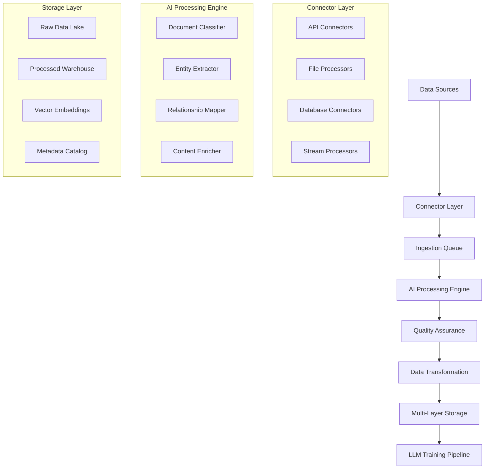

# 📄 Processing Pipeline & Connector Development Strategy
updated: 01/20/25

## Project Overview
Comprehensive technical specification for building a scalable data processing pipeline and connector ecosystem to handle diverse enterprise data sources across industries. This system integrates with LLM training pipelines to enable AI-powered business intelligence.

## Current Implementation Status
**Implementation Phase**: Detailed Technical Planning & Architecture Design

**Key Characteristics**:
- **Universal Connector Framework**: Plugin-based architecture supporting 50+ data source types
- **AI-First Processing**: LLM-powered extraction, classification, and enhancement at every stage
- **Industry-Specific Optimization**: Configurable processing logic with domain expertise
- **Enterprise-Grade Security**: End-to-end encryption, audit logging, compliance frameworks
- **Horizontal Scalability**: Container-based deployment with auto-scaling capabilities

---

## 🔄 Processing Pipeline Technical Architecture

### Pipeline Overview



### Core Processing Framework

#### Universal Data Processing Interface
```typescript
// Core processing pipeline interface
interface ProcessingPipeline {
  id: string;
  name: string;
  industry: string;
  version: string;
  stages: ProcessingStage[];
  configuration: PipelineConfig;
}

interface ProcessingStage {
  id: string;
  name: string;
  type: 'ingestion' | 'ai_processing' | 'quality' | 'transformation' | 'storage';
  processor: DataProcessor;
  dependencies: string[];
  parallelizable: boolean;
  retryPolicy: RetryPolicy;
}

// Main pipeline orchestrator
class PipelineOrchestrator {
  private pipelines: Map<string, ProcessingPipeline> = new Map();
  private executionQueue: Queue<PipelineJob>;
  private statusTracker: StatusTracker;
  
  async executePipeline(pipelineId: string, data: RawDataBatch): Promise<ProcessingResult> {
    const pipeline = this.pipelines.get(pipelineId);
    if (!pipeline) throw new Error(`Pipeline ${pipelineId} not found`);
    
    const jobId = generateJobId();
    const job: PipelineJob = {
      id: jobId,
      pipelineId: pipelineId,
      data: data,
      status: 'queued',
      startTime: new Date()
    };
    
    await this.executionQueue.add(job);
    return await this.executeJob(job);
  }
  
  private async executeJob(job: PipelineJob): Promise<ProcessingResult> {
    const pipeline = this.pipelines.get(job.pipelineId)!;
    let currentData = job.data;
    const stageResults: StageResult[] = [];
    
    try {
      // Execute stages in dependency order
      const executionOrder = this.calculateExecutionOrder(pipeline.stages);
      
      for (const stageGroup of executionOrder) {
        // Execute parallelizable stages concurrently
        const stagePromises = stageGroup.map(async (stage) => {
          const stageResult = await this.executeStage(stage, currentData);
          stageResults.push(stageResult);
          return stageResult;
        });
        
        const results = await Promise.all(stagePromises);
        currentData = this.mergeStageResults(results);
      }
      
      return {
        jobId: job.id,
        status: 'completed',
        processedData: currentData,
        stageResults: stageResults,
        executionTime: Date.now() - job.startTime.getTime()
      };
      
    } catch (error) {
      await this.handlePipelineError(job, error, stageResults);
      throw error;
    }
  }
}
```

#### AI Processing Engine Implementation
```typescript
// AI-powered document processing engine
class AIProcessingEngine {
  private classificationModel: LLMClassifier;
  private entityExtractor: EntityExtractor;
  private embeddingGenerator: EmbeddingGenerator;
  private qualityAnalyzer: QualityAnalyzer;
  
  async processDocument(document: RawDocument, context: ProcessingContext): Promise<ProcessedDocument> {
    const processingId = generateProcessingId();
    
    // Stage 1: Classification and content analysis
    const classification = await this.classifyDocument(document, context);
    
    // Stage 2: Entity extraction based on classification
    const entities = await this.extractEntities(document, classification);
    
    // Stage 3: Generate embeddings for semantic search
    const embeddings = await this.generateEmbeddings(document.content, classification);
    
    // Stage 4: Quality assessment and scoring
    const qualityMetrics = await this.assessQuality(document, entities, classification);
    
    // Stage 5: Relationship mapping
    const relationships = await this.mapRelationships(entities, context);
    
    return {
      id: processingId,
      originalDocument: document,
      classification: classification,
      extractedEntities: entities,
      embeddings: embeddings,
      qualityMetrics: qualityMetrics,
      relationships: relationships,
      processingMetadata: {
        processedAt: new Date(),
        processingVersion: '2.0',
        aiModelsUsed: this.getUsedModels(),
        processingTime: Date.now() - document.receivedAt.getTime()
      }
    };
  }
  
  private async classifyDocument(document: RawDocument, context: ProcessingContext): Promise<DocumentClassification> {
    const prompt = this.buildClassificationPrompt(document, context);
    
    const response = await this.classificationModel.classify(prompt, {
      temperature: 0.1,
      maxTokens: 500,
      responseFormat: 'structured_json'
    });
    
    return {
      primaryType: response.primary_type,
      subTypes: response.sub_types,
      industryContext: response.industry_context,
      confidenceScore: response.confidence,
      suggestedProcessingPath: response.processing_path,
      metadata: {
        classificationModel: this.classificationModel.modelId,
        classifiedAt: new Date()
      }
    };
  }
  
  private async extractEntities(document: RawDocument, classification: DocumentClassification): Promise<ExtractedEntity[]> {
    const extractionSchema = this.getExtractionSchemaForType(classification.primaryType);
    
    const entityExtractionPrompt = {
      content: document.content,
      schema: extractionSchema,
      context: classification.industryContext,
      instructions: 'Extract all entities according to the provided schema. Return confidence scores for each extraction.'
    };
    
    const extractionResult = await this.entityExtractor.extract(entityExtractionPrompt);
    
    return extractionResult.entities.map(entity => ({
      type: entity.type,
      value: entity.value,
      confidence: entity.confidence,
      startPosition: entity.start_pos,
      endPosition: entity.end_pos,
      context: entity.surrounding_context,
      metadata: {
        extractionMethod: 'llm_guided',
        extractedAt: new Date(),
        sourceDocument: document.id
      }
    }));
  }
}
```

#### Data Quality Assurance Framework
```typescript
// Comprehensive data quality management
class DataQualityEngine {
  private validationRules: Map<string, ValidationRule[]>;
  private qualityMetrics: QualityMetricsCalculator;
  private anomalyDetector: AnomalyDetector;
  
  async assessAndImproveQuality(data: ProcessedDocument[], context: QualityContext): Promise<QualityAssessmentResult> {
    const assessmentId = generateAssessmentId();
    
    // Run parallel quality checks
    const [validationResults, qualityScores, anomalies, deduplicationResults] = await Promise.all([
      this.validateData(data, context),
      this.calculateQualityScores(data),
      this.detectAnomalies(data, context),
      this.deduplicateData(data)
    ]);
    
    // Generate improvement recommendations
    const recommendations = await this.generateImprovementRecommendations({
      validationResults,
      qualityScores,
      anomalies,
      deduplicationResults
    });
    
    return {
      assessmentId: assessmentId,
      overallQualityScore: this.calculateOverallScore(qualityScores),
      validationResults: validationResults,
      qualityScores: qualityScores,
      detectedAnomalies: anomalies,
      deduplicationResults: deduplicationResults,
      recommendations: recommendations,
      assessmentMetadata: {
        assessedAt: new Date(),
        dataVolumeProcessed: data.length,
        qualityEngine: 'v2.0'
      }
    };
  }
  
  private async validateData(data: ProcessedDocument[], context: QualityContext): Promise<ValidationResult[]> {
    const industryRules = this.validationRules.get(context.industry) || [];
    const globalRules = this.validationRules.get('global') || [];
    const allRules = [...industryRules, ...globalRules];
    
    return await Promise.all(
      data.map(async (document) => {
        const ruleResults = await Promise.all(
          allRules.map(rule => this.executeValidationRule(rule, document, context))
        );
        
        return {
          documentId: document.id,
          overallStatus: this.determineValidationStatus(ruleResults),
          ruleResults: ruleResults,
          criticalIssues: ruleResults.filter(r => r.severity === 'critical'),
          warnings: ruleResults.filter(r => r.severity === 'warning'),
          validationMetadata: {
            validatedAt: new Date(),
            rulesApplied: allRules.length
          }
        };
      })
    );
  }
}
```

---

## 🔌 Connector Development Strategy

### General Design Guidelines
- **Component-Based Architecture**: Modular connectors for easy expansion
- **Abstraction Layer**: Common interface for all data types
- **Error Handling**: Robust logging and retry mechanisms
- **Scalability**: Designed to handle large data volumes

### API Connectors
- **RESTful and SOAP Support**: Handle modern and legacy systems
- **OAuth 2.0 Integration**: Secure authentication for data access
- **Rate Limiting Management**: Automatic handling of API limits
- **Real-Time Webhooks**: Support for push-based updates

### File Connectors
- **Multi-Format Support**: PDF, Excel, Word, CSV, JSON, XML
- **Batch Processing**: Efficient handling of large file sets
- **AI Enhancement**: LLM-powered document parsing and metadata extraction
- **Metadata Inclusion**: Capture file attributes and context

### Database Connectors
- **SQL and NoSQL Support**: For structured and unstructured data
- **Connection Pooling**: Efficient usage of database connections
- **Data Transformation**: Schema mapping and conversion
- **Change Data Capture**: Real-time updates from transactional databases

### Stream Connectors
- **Kafka, Kinesis, Pulsar**: Support for mainstream stream processing
- **Event-Driven Architecture**: Asynchronous message handling
- **In-Memory Processing**: Low-latency data transformation
- **Backpressure Management**: Smooth processing with flow control

---

## 📊 Key Development Considerations

### Security and Compliance
- **Encrypted Data Transmission**: TLS for all data in motion
- **Access Control Lists**: Fine-grained permissions for connector access
- **Audit Logging**: Detailed tracking of data access and transformations
- **Compliance Frameworks**: Adherence to GDPR, CCPA, HIPAA, SOX

### Performance and Scalability
- **Horizontal Scalability**: Containerized connector services
- **Load Balancing**: Distribute workload efficiently
- **Caching Strategies**: Reduce redundant processing tasks
- **Dynamic Resource Allocation**: Auto-scaling based on demand

### Monitoring and Maintenance
- **Health Checks**: Regular monitoring of connector status
- **Automated Alerts**: Notifications for failures or latency issues
- **Version Management**: Controlled deployment of changes
- **Maintenance Windows**: Scheduled updates without downtime

---

## 📅 Implementation Plan

### Phase 1: Connector Framework (Weeks 1-4)
- [ ] Develop base connector interfaces for all data types
- [ ] Implement core API and file connectors
- [ ] Establish authentication and authorization protocols
- [ ] Develop logging and error handling mechanisms

### Phase 2: Enhanced Features (Weeks 5-8)
- [ ] Implement AI-based document parsing capabilities
- [ ] Integrate quality assurance modules
- [ ] Build real-time stream processing connectors
- [ ] Establish compliance and security features

### Phase 3: Industry Adaptation (Weeks 9-12)
- [ ] Customize connectors for legal industry specifics
- [ ] Develop custom processing logic for insurance data
- [ ] Optimize for manufacturing data handling
- [ ] Test with pilot clients and refine

### Phase 4: Advanced Capabilities (Weeks 13-16)
- [ ] Build a GUI for creating custom connectors
- [ ] Develop advanced analytics and reporting
- [ ] Implement client-specific customization features
- [ ] Launch a marketplace for third-party connector extensions

---

This document provides a detailed strategy for developing a comprehensive data processing pipeline and versatile connector framework that can adapt to different industries and data sources. The phased implementation plan ensures a methodical approach to building, testing, and scaling the system for diverse use cases.
